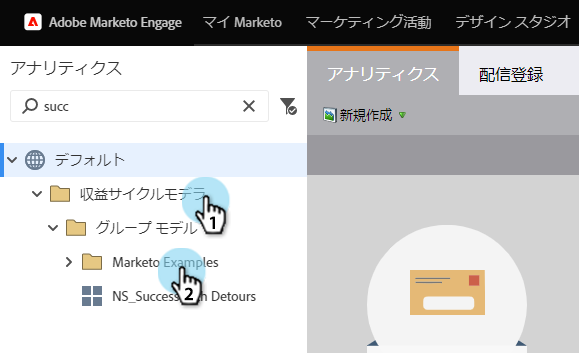

# マーケティング担当者の売上高例モデルのコピー {#cloning-a-marketo-example-revenue-model}

マーケターには、ユーザーの心を動かすための売上モデルの例があります。 これらのモデラーをコピーして、独自のモデルにします。 方法を次に示します。

1. 「 **解析** 」領域に移動します。

   

1. 「**Revenue Cycle Modeler **folder」を選択し、「 **Markettor Examples**」をクリックします。

   

1. モデラーの1つを選択します。

   

   「モデル・アクション」で、「モデルのコピー」を選択します。
   

1. **名前**を入力し、「 **クローン**」をクリックします。

   

   売上高を生み出すだけで簡単な場合！

