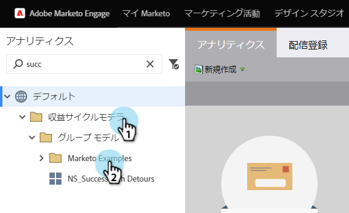

# Marketo 収益モデル例の複製 {#cloning-a-marketo-example-revenue-model}

Marketo には、刺激を与えるのに役立つ収益モデラーの例が用意されています。これらのモデラーを複製し、独自のモデルにします。その方法をご紹介します。

1. **[!UICONTROL 分析]**&#x200B;領域に移動します。

   

1. **[!UICONTROL 収益サイクルモデラー]**&#x200B;フォルダーを選択し、**[!UICONTROL Marketo の例]**&#x200B;をクリックします。

   

1. モデルを 1 つ選択します。

   

1. [!UICONTROL モデルアクション]で、「**[!UICONTROL モデルを複製]**」を選択します。

   

1. **[!UICONTROL 名前]**&#x200B;を入力して「**[!UICONTROL 複製]**」をクリックします。

   

   収益を創出するのがこれだけ簡単だったらいいですね。
