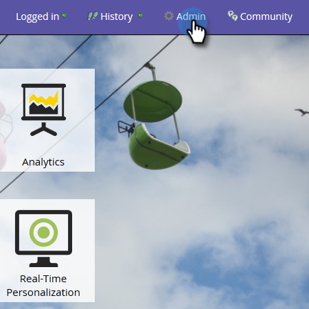

# モデルパフォーマンス分析（リード）のカスタムフィールドグループを有効にする{#enable-custom-field-groups-for-model-performance-analysis-leads}

>[!PREREQUISITES]
>
>標準フィールドまたはユーザー設定フィールドをグループに分類して、Marketorのフィールドオーガナイザーでレポートできます。 詳しくは、「[フィールドの整理でカスタムフィールドグループを作成する](/help/marketo/product-docs/reporting/revenue-cycle-analytics/revenue-tools/field-organizers/create-custom-field-groups-using-the-field-organizer.md)」を参照してください。

<table> 
 <tbody> 
  <tr> 
   <td colspan="3" rowspan="1">
<strong>カスタムフィールドグループを有効にすると、売上高サイクルエクスプローラの複数の分析領域にどのような影響を与えますか。</strong>
</td> 
  </tr> 
  <tr> 
   <td colspan="1" rowspan="1">
<strong>何が起こる… ?</strong>
</td> 
   <td colspan="1" rowspan="1">
<strong>モデルパフォーマンス分析（リード）領域への影響</strong>
</td> 
   <td colspan="1" rowspan="1">
<strong>リードの分析、キャンペーンの分析、オポチュニティの分析領域に与える影響</strong>
</td> 
  </tr> 
  <tr> 
   <td colspan="1" rowspan="1">
<strong>標準のリードまたは会社フィールドに関連付けられたカスタムフィールドグループを有効にすると、どうなりますか？</strong>
</td> 
   <td colspan="1" rowspan="1">
カスタムフィールドグループは、モデルパフォーマンス分析（リード）領域でのレポートに対して有効になっています
</td> 
   <td colspan="1" rowspan="1">
影響なし
</td> 
  </tr> 
  <tr> 
   <td colspan="1" rowspan="1">
<strong>ユーザー設定のユーザー設定の個人または会社フィールドに関連付けられたユーザー設定のフィールドグループを有効にするとどうなりますか？</strong>
</td> 
   <td colspan="1" rowspan="1">
カスタムフィールドグループは、モデルパフォーマンス分析（リード）領域でのレポートに対して有効になっています
</td> 
   <td colspan="1" rowspan="1">
カスタムフィールド自体は、リード分析、キャンペーン分析、商談分析領域でのレポートに対して有効になります。

<strong>注意：</strong> カスタムフィールドグループは、これらの分析領域ではサポートされないので、グループの関連付けは売上高サイクルエクスプローラには表示されません。カスタムフィールド<em></em> のみに表示されます。
</td> 
  </tr> 
 </tbody> 
</table>

次の手順に従って、「モデルパフォーマンス分析（リード）」領域でレポート用のカスタムフィールドグループを有効にします。

1. 「**管理者**」をクリックします。

   

1. 「**売上高サイクル分析**」をクリックします。

   

1. 空のフィールドグループの横にある「**なし**」をクリックします。 既に3つのフィールドグループが有効になっていて、編集する場合は、変更するフィールドグループの名前をクリックします。

   

1. **フィールド**&#x200B;ドロップダウンをクリックし、目的のフィールドを選択します。

   

   >[!NOTE]
   >
   >次の使用例は、標準フィールド（状態）に対してユーザー設定フィールドグループを有効にしました。 したがって、影響を受けたのは、モデルのパフォーマンス分析（リード）領域のみです。 カスタムの個人または会社フィールドのカスタムフィールドグループが有効になっている場合、有効なグループは「Sync Summary」タブの「Model Performance Management (Leads)」セクションに表示され、「Lead」、「Opportunity」分析のカスタムフィールド数は1増えます。

1. 「**保存**」をクリックします。

   
