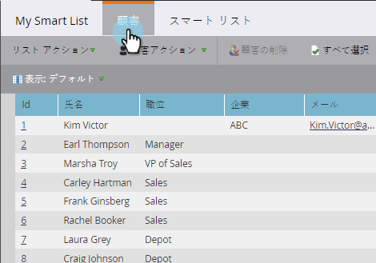

# 売上高サイクルモデルですべてのリードを検索する {#find-all-leads-in-a-revenue-cycle-model}

スマートリストを使用すると、売上高サイクルモデルのすべてのメンバーを容易に検索できます。

>[!PREREQUISITES]
>
>[スマートリストの作成](/help/marketo/product-docs/core-marketo-concepts/smart-lists-and-static-lists/creating-a-smart-list/create-a-smart-list.md)

1. スマートリストが選択された状態で、「**スマートリスト**」タブをクリックします。

   

1. 「**売上高モデルのメンバー**」フィルターを探し、キャンバスまでドラッグします。

   

1. 「**モデル**」を選択します。

   

   これにより、ステージに関係なく、モデル内のすべてのリードが得られます。通常は、特定のステージが必要です。代わりに、次のフィルターを使用します。

1. 「**売上高ステージ**」フィルターを探し、キャンバスまでドラッグします。

   

1. 「**ステージ**」を選択します。

   

1. 「**リード**」タブに移動して、結果を確認します。

   

   >[!TIP]
   >
   >フィルターは両方は必要ではありません。必要なフィルターだけを選択してください。ここでは、念のために両方のフィルターを説明しているだけです。

   >[!CAUTION]
   >
   >最初にリードを作成中に外部キャンペーンによってリードのステージが変更された場合、アクティビティはデータベースに記録されません。これは、リードがスマートリストフィルターに含まれないことを意味します。
