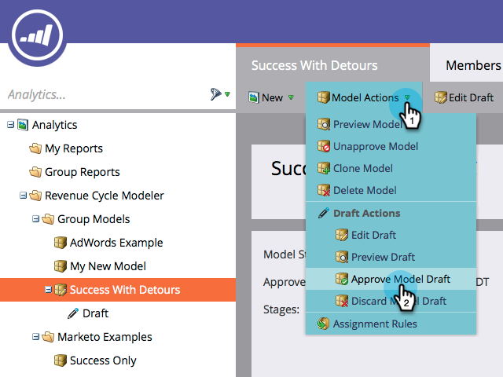

# 売上高モデラーで 2 つのステージを結合する {#merging-two-stages-in-the-revenue-modeler}

モデルを承認した後は、ドラフトの編集時にステージを削除できません。かわりに、そのステージを他のステージと結合することができます。

1. 「**Marketo ホーム**」をクリックし、「**[!UICONTROL Analytics]**」を選択します。

   

1. 承認したモデルをクリックします。

   

1. 「**[!UICONTROL ドラフトの編集]**」をクリックします。

   

1. 結合したいステージを右クリックして、メニューで「**[!UICONTROL ステージの]結合**」を選択します。

   

1. プルダウンで特定のステージをクリックします。

   

1. **[!UICONTROL モデルアクション]**&#x200B;メニューで「**[!UICONTROL モデルのドラフトの承認]**」を選択すれば、モデルを再度承認できます。

   

>[!NOTE]
>
>[!UICONTROL ステージの結合]プルダウンで「**[!UICONTROL なし]**」を選択し、リードをモデルから削除します
