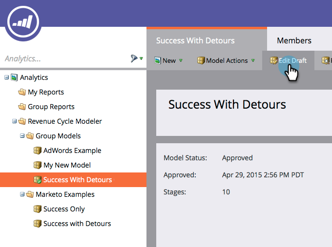

# 売上高モデラーで 2 つのステージを結合する {#merging-two-stages-in-the-revenue-modeler}

モデルを承認した後は、ドラフトの編集時にステージを削除できません。かわりに、そのステージを他のステージと結合することができます。

1. 「**Marketo ホーム**」をクリックし、「**Analytics**」を選択します。

   

1. 承認したモデルをクリックします。

   

1. 「**ドラフトの編集**」をクリックします。

   

1. 結合したいステージを右クリックして、メニューで「**ステージの結合**」を選択します。

   

1. プルダウンで特定のステージをクリックします。

   

1. **モデルアクション**&#x200B;メニューで「**モデルのドラフトの承認**」を選択すれば、モデルを再度承認できます。

   

>[!NOTE]
>
>ステージの結合プルダウンで「**なし**」を選択し、リードをモデルから削除します。
