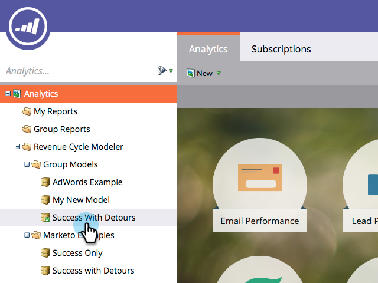

# 2つのステージを売上モデラーにマージする{#merging-two-stages-in-the-revenue-modeler}

モデルを承認した後は、ドラフトの編集時にステージを削除できません。 代わりに、そのステージを別のステージとマージできます。

1. 「**マーケティング先ホーム**」をクリックし、「**解析**」を選択します。

   

1. 承認済みのモデルをクリックします。

   

1. 「**ドラフトを編集」をクリックします。**

   

1. マージするステージを右クリックし、メニューで「**Merge Stage**」を選択します。

   

1. プルダウンで特定のステージをクリックします。

   

1. モデルを再承認するには、**モデルアクション**&#x200B;メニューで「**ドラフトを承認**」を選択します。

   

>[!NOTE]
>
>Merge Stageプルダウンで&#x200B;**None**&#x200B;を選択し、モデルからリードを削除します。
