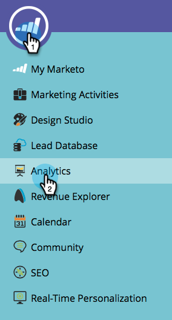

# 売上高モデラーで 2 つのステージを結合する {#merging-two-stages-in-the-revenue-modeler}

モデルを承認した後は、ドラフトの編集時にステージを削除できません。かわりに、そのステージを他のステージと結合することができます。

1. 「**Marketo ホーム**」をクリックし、「**[!UICONTROL Analytics]**」を選択します。

   

1. 承認したモデルをクリックします。

   

1. 「**[!UICONTROL ドラフトの編集]**」をクリックします。

   

1. 結合するステージを右クリックし、メニューで **[!UICONTROL 結合 &#x200B;] ステージ** を選択します。

   

1. プルダウンで特定のステージをクリックします。

   

1. **[!UICONTROL モデルアクション]**&#x200B;メニューで「**[!UICONTROL モデルのドラフトの承認]**」を選択すれば、モデルを再度承認できます。

   

>[!NOTE]
>
>**[!UICONTROL 結合ステージ]** プルダウンで「[!UICONTROL &#x200B; なし &#x200B;]」を選択し、モデルからリードを削除します
