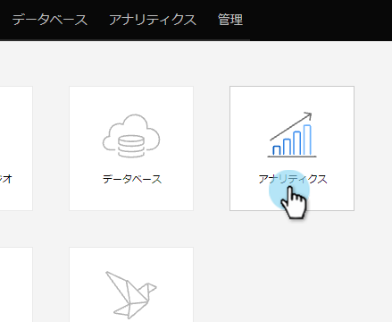

# 売上高モデルに関するレポート{#report-on-your-revenue-model}

各売上サイクルモデルについて、各ステージのリード数に関するレポートを生成できます。

>[!NOTE]
>
>レポートに含めるには、リードがモデルのメンバーである必要があります。

1. **Analytics**&#x200B;に移動します。

   

1. 「**売上高ステージ**&#x200B;のリード」をクリックします。

   

1. 「**セットアップ**」タブをクリックし、フィルターセクションの下の「**売上高サイクルモデル**」を重複クリックします。

   

1. 承認された&#x200B;**モデル**&#x200B;を選択します。

   

   >[!NOTE]
   >
   >このドロップダウンメニューから使用するには、モデルが承認されているか、少なくとも承認されたステージがある必要があります。

1. 「**レポート**」タブをクリックして、売上高サイクルモデルの各段階のリード数を表示します。

   

これはなぜ役に立つのですか？ モデルは、販売とマーケティングファネルを示します。 問題になる前にボトルネックを特定するために、時間の経過と共にバランスを追跡します。
