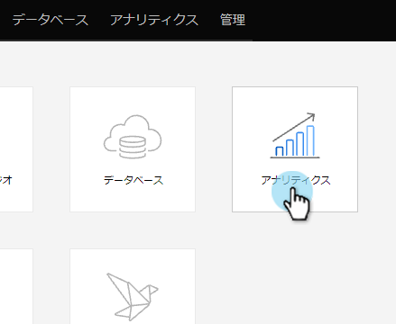

# 収益モデルのレポート {#report-on-your-revenue-model}

収益サイクルモデルごとに、各ステージのリード数に関するレポートを生成できます。

>[!NOTE]
>
>レポートに含めるリードは、モデルのメンバーである必要があります。

1. **[!UICONTROL 分析]**&#x200B;に移動します。

   

1. **[!UICONTROL リード - 収益ステージ別]**&#x200B;をクリックします。

   

1. 「**[!UICONTROL 設定]**」タブをクリックし、フィルターセクションの下で「**[!UICONTROL 収益サイクルモデル]**」をダブルクリックします。

   

1. 承認済み&#x200B;**[!UICONTROL モデル]**&#x200B;を選択します。

   

   >[!NOTE]
   >
   >このドロップダウンメニューから使用できるようにするには、モデルが承認されているか、少なくとも承認済みのステージがある必要があります。

1. 「**[!UICONTROL レポート]**」タブをクリックして、収益サイクルモデルの各ステージにあるリード数を確認します。

   

これはなぜ役に立つのでしょうか。モデルは、セールスとマーケティングのファネルを示します。問題が発生する前にボトルネックを特定するために、時間の経過と共にバランスを追跡します。
