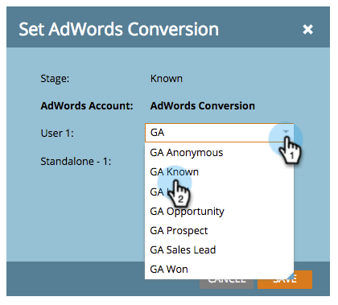

# マネージャーアカウントを使用した売上高モデルでのGoogle AdWordsコンバージョンの設定 {#set-google-adwords-conversions-in-the-revenue-model-with-a-manager-account}

Google AdWordsアカウントをMarketorにリンクして、オフラインコンバージョンデータをMarketoからGoogle AdWordsに自動的にアップロードします。 次に、AdWords UIから、AdWordsにカスタム列を [追加した後、条件を満たしたリード、オポチュニティ、新規顧客(または追跡したい任意の売上高ステージ](https://support.google.com/adwords/answer/3073556) )に導いたクリックを簡単に確認できます。

複数のGoogle Adwordsアカウントがある場合は、 [Google AdWords Managerアカウント](https://www.google.com/adwords/manager-accounts/) （旧称My Client Center）を使用して、それらをMarketoと統合できます。

AdWordsのオフラインコンバージョンを、売上高モデルの1つ以上のステージにマッピングできます。 次の2つの方法があります。

* Stage Action
* AdWordsマッピング

>[!NOTE]
>
>**前提条件**
>
>* [マネージャーアカウントを追加持つLaunchpointサービスとしてのGoogle AdWords](../../../../product-docs/administration/additional-integrations/add-google-adwords-as-a-launchpoint-service-with-a-manager-account.md)

>

## Use Stage Action {#use-stage-action}

「ステージアクション」の下のAdWordsコンバージョンのマッピングを参照してください。

1. AdWordsコンバージョンにマッピングする手順を選択します。

   

1. 「 **ステージアクション** 」ドロップダウンで、「AdWords変換の **設定**」を選択します。

   

1. AdWordsコンバージョ **ンの設定**。

   >[!NOTE]
   >
   >子アカウントごとに異なるAdWordsコンバージョンを選択できます。

   

   ヒント：AdWordsのコンバージョンがない場合は、「 **+新規コンバージョン**」をクリックして作成します。

   

1. 「 **保存**」をクリックします。

   

1. すべてのAdWordsコンバージョンの売上高ステージへのマッピングが完了したら、サマリページに戻ります。 「 **モデルのアクション** 」を選択し、「ステージの **承認**」を選択します。

   

## プロのヒント：新追加しいコンバージョン {#pro-tip-add-a-new-conversion}

プロチップ！ 新しいAdWordsオフラインコンバージョンは、Marketoから作成できます。

>[!CAUTION]
>
>Marketorから作成された新しいコンバージョンでは、「最適化」設定が有効になっています。 つまり、AdWords入札戦略では、これらのコンバージョンに対する入札を最適化できます。 この設定は、AdWordsアカウントで変更できます。

1. 「 **ステージアクション** 」ドロップダウンで、「AdWords変換の **設定**」を選択します。

   

1. 「 **新しいコンバージョン**」を選択します。

   ** 

   **

1. 「 **変換名**」を入力します。 「 **保存**」をクリックします。

   

   素晴らしい！ この新しいコンバージョンは、AdWordsアカウントに表示されます。

## AdWordsマッピングを使用する {#use-adwords-mapping}

AdWordsのマッピングを使用して、すべてのモデルステージをAdWordsコンバージョンに1か所で関連付けることができます。

1. 「AdWordsのマッピングを **編集**」を選択します。

   

1. 追跡する各ステージに対して、目的の **AdWordsアカウント** (AdWords)と目的の **AdWordsコンバージョン(AdWords Conversion** )を選択します。

   

1. ステージをマッピングしたら、「 **保存**」をクリックします。

   

1. すべてのAdWordsコンバージョンの売上高ステージへのマッピングが完了したら、サマリページに戻ります。 「 **モデルのアクション** 」を選択し、「ステージの **承認**」を選択します。

   

オフラインコンバージョンデータを表示するには、AdWordsアカウントにログインする必要があります。 Marketoからインポートしたオフラインコンバージョンごとに、 [カスタム列機能を使用して](https://support.google.com/adwords/answer/3073556) 、コンバージョン数列を作成することをお勧めします。
