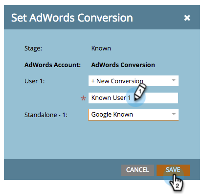

# マネージャ [!DNL Google AdWords] アカウントを持つ収益モデルでのコンバージョンの設定 {#set-google-adwords-conversions-in-the-revenue-model-with-a-manager-account}

[!DNL Google AdWords] アカウントを Marketo にリンクして、オフラインのコンバージョンデータを Marketo から [!DNL Google AdWords] に自動的にアップロードします。その後、[!DNL AdWords] UI から、[ で ](https://support.google.com/adwords/answer/3073556) カスタム列を追加 [!DNL AdWords] した後、どのクリックが適格なリード、商談、新規顧客（または追跡したい収益ステージ）につながったかを簡単に確認できます。

複数の [!DNL Google Adwords] アカウントがある場合は、[[!DNL Google AdWords] Manager アカウント ](https://www.google.com/adwords/manager-accounts/) （旧称：My Client Center）を使用して、それらをMarketoと統合できます。

[!DNL AdWords] のオフラインコンバージョンを収益モデルの 1 つ以上のステージにマッピングできます。 次の 2 つの方法があります。

* ステージアクション
* [!DNL AdWords] マッピング

>[!PREREQUISITES]
>
>[ マネージャ  [!DNL Google AdWords]  アカウントを持つ Launchpoint Service として追加 ](/help/marketo/product-docs/administration/additional-integrations/add-google-adwords-as-a-launchpoint-service-with-a-manager-account.md)

## ステージアクションを使用する {#use-stage-action}

「ステージアクション」の下で [!DNL AdWords] コンバージョンをマッピングします。

1. [!DNL AdWords] 変換にマッピングするステップを選択します。

   

1. **[!UICONTROL ステージアクション]**&#x200B;ドロップダウンで、「**[!UICONTROL AdWords コンバージョンを設定]**」を選択します。

   

1. **[!DNL AdWords]変換を設定**.

   >[!NOTE]
   >
   >子アカウントごとに異なる [!DNL AdWords] コンバージョンを選択できます。

   

   ヒント：[!DNL AdWords] しいコンバージョンがない場合は、「**[!UICONTROL +新規コンバージョン]**」をクリックして作成します。

   

1. 「**[!UICONTROL 保存]**」をクリックします。

   

1. すべての [!DNL AdWords] コンバージョンの売上高ステージへのマッピングが完了したら、概要ページに戻ります。 「**[!UICONTROL モデルアクション]**」を選択し、「**[!UICONTROL ステージの承認]**」を選択します。

   

## 上級ヒント：新しいコンバージョンを追加する {#pro-tip-add-a-new-conversion}

上級向けのヒントです。新しい [!DNL AdWords] オフラインコンバージョンをMarketoから作成できます。

>[!CAUTION]
>
>Marketo から作成された新しいコンバージョンでは、「最適化」設定が有効になっています。つまり、入札戦略 [!DNL AdWords] よって、これらのコンバージョンに対する入札を最適化できます。 この設定は [!DNL AdWords] アカウントから変更できます。

1. **[!UICONTROL ステージアクション]**&#x200B;ドロップダウンで、「**[!UICONTROL AdWords コンバージョンを設定]**」を選択します。

   

1. 「**[!UICONTROL 新しいコンバージョン]**」を選択します。

   

1. **コンバージョン名**&#x200B;を入力します。「**[!UICONTROL 保存]**」をクリックします。

   

   これで完了です。この新しいコンバージョンは、[!DNL AdWords] アカウントに表示されます。

## [!DNL AdWords] マッピングの使用 {#use-adwords-mapping}

[!DNL AdWords] マッピングを使用すると、すべてのモデルステージを [!DNL AdWords] コンバージョンに 1 か所で関連付けることができます。

1. 「**[!UICONTROL AdWords マッピングの編集]**」を選択します。

   

1. 追跡するステージごとに **[!DNL AdWords]目的の** アカウントと目的の **[!DNL AdWords]コンバージョン** を選択します。

   

1. ステージをマッピングしたら、「**[!UICONTROL 保存]**」をクリックします。

   

1. すべての [!DNL AdWords] コンバージョンの売上高ステージへのマッピングが完了したら、概要ページに戻ります。 「**[!UICONTROL モデルアクション]**」を選択し、「**[!UICONTROL ステージの承認]**」を選択します。

   

オフラインコンバージョンデータを表示するには、[!DNL AdWords] アカウントにログインする必要があります。 [カスタム列機能](https://support.google.com/adwords/answer/3073556)を使用して、Marketo にインポートするオフラインコンバージョンごとにコンバージョン数の列を作成することをお勧めします。
