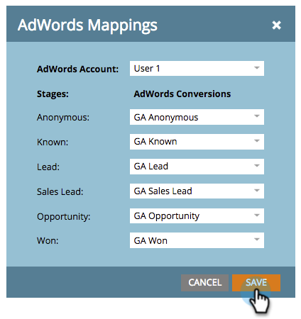

# マネージャーアカウントを使用した収益モデルでの Google AdWords  コンバージョンの設定 {#set-google-adwords-conversions-in-the-revenue-model-with-a-manager-account}

Google AdWords のアカウントを Marketo とリンクすると、オフラインのコンバージョンデータが Marketo から GoogleAdWords に自動的にアップロードされます。[カスタム列を追加した後には](https://support.google.com/adwords/answer/3073556)、AdWords UI を使って、どのクリックが資格を満たすリード、商談、新規顧客 (あるいは追跡した収益ステージ) につながったかを簡単に確認できるようになります。

複数の Google Adwords アカウントがある場合、[Google AdWords マネージャーアカウント](https://www.google.com/adwords/manager-accounts/)（旧称：マイクライアントセンター）を使用して、Marketo と統合できます。

AdWords オフラインコンバージョンを収益モデルの 1 つ以上のステージにマッピングできます。次の 2 つの方法があります。

* ステージアクション
* AdWords マッピング

>[!PREREQUISITES]
>
>[マネージャーアカウントによる Google AdWords を LaunchPoint サービスとして追加](/help/marketo/product-docs/administration/additional-integrations/add-google-adwords-as-a-launchpoint-service-with-a-manager-account.md)

## ステージアクションを使用する {#use-stage-action}

ステージアクションで AdWords コンバージョンをマッピングします。

1. AdWords コンバージョンにマッピングする手順を選択します。

   

1. **ステージアクション**&#x200B;ドロップダウンで、「**AdWords コンバージョンを設定**」を選択します。

   

1. **AdWords コンバージョンの設定**.

   >[!NOTE]
   >
   >子アカウントごとに異なる AdWords コンバージョンを選択できます。

   

   ヒント：AdWords 変換がない場合は、「**+新しいコンバージョン**」をクリックして作成します。

   

1. 「**保存**」をクリックします。

   

1. すべての AdWords コンバージョンを収益ステージにマッピングしたら、概要ページに戻ります。「**モデルアクション**」を選択し、「**ステージの承認**」を選択します。

   

## 上級ヒント：新しいコンバージョンを追加する {#pro-tip-add-a-new-conversion}

上級向けのヒントです。新しい AdWords オフラインコンバージョンは、Marketo から作成できます。

>[!CAUTION]
>
>Marketo から作成された新しいコンバージョンでは、「最適化」設定が有効になっています。つまり、このコンバージョンについては、AdWords の入札方針を利用して入札を最適化できるということです。この設定は、AdWords アカウントから変更できます。

1. **ステージアクション**&#x200B;ドロップダウンで、「**AdWords コンバージョンを設定**」を選択します。

   

1. 「**新しいコンバージョン**」を選択します。

   

1. **コンバージョン名**&#x200B;を入力します。「**保存**」をクリックします。

   

   これで完了です。この新しいコンバージョンは、AdWords アカウントに表示されます。

## AdWords マッピングを使用する {#use-adwords-mapping}

AdWords マッピングを使用して、すべてのモデルステージを AdWords コンバージョンに 1 か所で関連付けることができます。

1. 「**AdWords マッピングの編集**」を選択します。

   

1. 追跡する各ステージで、目的の **AdWords アカウント**&#x200B;と **AdWords コンバージョン**&#x200B;を選択します。

   

1. ステージをマッピングしたら、「**保存**」をクリックします。

   

1. すべての AdWords コンバージョンを収益ステージにマッピングしたら、概要ページに戻ります。「**モデルアクション**」を選択し、「**ステージの承認**」を選択します。

   

オフラインのコンバージョンデータを表示するには、AdWords アカウントにログインする必要があります。[カスタム列機能](https://support.google.com/adwords/answer/3073556)を使用して、Marketo にインポートするオフラインコンバージョンごとにコンバージョン数の列を作成することをお勧めします。
