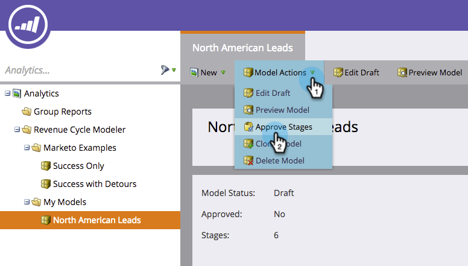

# 売上高モデルでのGoogle AdWordsコンバージョンの設定{#set-google-adwords-conversions-in-the-revenue-model}

Google AdWordsアカウントをMarketoにリンクして、オフラインコンバージョンデータをMarketoからGoogle AdWordsに自動的にアップロードします。 次に、AdWords UIから、AdWordsにカスタム列](https://support.google.com/adwords/answer/3073556)を追加した後、条件を満たしたリード、オポチュニティ、新規顧客（または追跡したい任意の売上高ステージ）に導いたクリックを簡単に確認できます。[

>[!NOTE]
>
>これは、MarketoからGoogle AdWordsへのプッシュ統合です。 コンバージョンデータは、Google AdWordsポータルに&#x200B;__&#x200B;のみ&#x200B;_表示され、MarketoのUI_&#x200B;には表示されません。

[Googleのオフラインコンバージョンインポート機能](https://support.google.com/adwords/answer/2998031?hl=en)の詳細を表示します。 AdWordsのオフラインコンバージョンを売上高モデルの1つ以上のステージにマッピングします。 マッピングを行う方法は3つあります。

* AdWordsコンバージョン
* Stage Action
* AdWordsマッピング

Stage Actionを使用する場合は、Marketoから新しいAdWordsオフラインコンバージョンを作成できます。

>[!PREREQUISITES]
>
>[LaunchPoint追加サービスとしてのGoogle AdWords](/help/marketo/product-docs/administration/additional-integrations/add-google-adwords-as-a-launchpoint-service.md)

## AdWordsコンバージョンを使用{#use-adwords-conversion}

1. 「**Analytics**」領域に移動します。

   

1. モデルを選択します。

   

1. 「**ドラフトを編集**」をクリックします。

   

1. AdWordsコンバージョンにマップする売上高ステージを選択します。

   

1. Marketoのステージにマップする&#x200B;**AdWordsコンバージョン**&#x200B;を選択します。

   

   ナイス！ AdWordsコンバージョンデータは、選択したカデンスでGoogle AdWordsにアップロードされます。

## Use Stage Action {#use-stage-action}

「Stage Actions」でAdWordsコンバージョンをマッピングすることもできます。

1. AdWordsコンバージョンにマッピングする手順を選択します。

   

1. 「**ステージアクション**」ドロップダウンで、「**AdWordsコンバージョンを設定**」を選択します。

   

1. **AdWordsコンバージョン**&#x200B;を選択します。

   

   **ヒント**:AdWordsのコンバージョンがない場合は、「 **+新規コンバージョン**」をクリックして作成します。

   

1. 「**保存**」をクリックします。

   

1. すべてのAdWordsコンバージョンの売上高ステージへのマッピングが完了したら、サマリページに戻ります。 「**モデルアクション**」を選択し、「**ステージを承認**」を選択します。

   

## プロのヒント：追加新しいコンバージョン{#pro-tip-add-a-new-conversion}

プロチップ！ 新しいAdWordsオフラインコンバージョンは、Marketoから作成できます。

>[!CAUTION]
>
>Marketoから作成された新しいコンバージョンでは、「最適化」設定が有効になっています。 つまり、AdWords入札戦略では、これらのコンバージョンに対する入札を最適化できます。 この設定は、AdWordsアカウントで変更できます。

1. 「**ステージアクション**」ドロップダウンで、「**AdWordsコンバージョンを設定**」を選択します。

   

1. 「**新しいコンバージョン**」を選択します。

   

1. **コンバージョン名**&#x200B;を入力します。 「**保存**」をクリックします。

   

   素晴らしい！ この新しいコンバージョンは、AdWordsアカウントに表示されます。

## AdWordsマッピングを使用{#use-adwords-mapping}

AdWordsのマッピングを使用して、すべてのモデルステージをAdWordsコンバージョンに1か所で関連付けることができます。

1. 「**AdWordsのマッピングを編集**」を選択します。

   

1. 追跡する各ステージに対して、目的の&#x200B;**AdWordsコンバージョン**&#x200B;を選択します。

   

1. ステージをマッピングしたら、「**保存**」をクリックします。

   

1. すべてのAdWordsコンバージョンの売上高ステージへのマッピングが完了したら、サマリページに戻ります。 「**モデルアクション**」を選択し、「**ステージを承認**」を選択します。

   

オフラインコンバージョンデータを表示するには、AdWordsアカウントにログインする必要があります。 [カスタム列機能](https://support.google.com/adwords/answer/3073556)を使用して、Marketoからインポートしたオフラインコンバージョンごとにコンバージョン数列を作成することをお勧めします。
