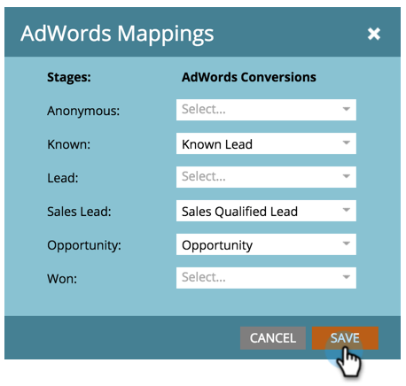

# 売上高モデルでのGoogle AdWordsコンバージョンの設定 {#set-google-adwords-conversions-in-the-revenue-model}

Google AdWordsアカウントをMarketorにリンクして、オフラインコンバージョンデータをMarketoからGoogle AdWordsに自動的にアップロードします。 次に、AdWords UIから、AdWordsにカスタム列を [追加した後、条件を満たしたリード、オポチュニティ、新規顧客(または追跡したい任意の売上高ステージ](https://support.google.com/adwords/answer/3073556) )に導いたクリックを簡単に確認できます。

>[!NOTE]
>
>これは、MarkettoからGoogle AdWordsへのプッシュ統合です。 コンバージョンデータはGoogle AdWordsポータル *にのみ表示され* 、** Marketto UIには表示されません。**

[Googleのオフラインコンバージョンインポート機能についての詳細](https://support.google.com/adwords/answer/2998031?hl=en)。  AdWordsのオフラインコンバージョンを売上高モデルの1つ以上のステージにマッピングします。 マッピングを行う方法は3つあります。

* AdWordsコンバージョン
* Stage Action
* AdWordsマッピング

Stage Actionを使用する場合は、MarketからAdWordsの新しいオフラインコンバージョンを作成できます。

>[!PREREQUISITES]
>
>* [LaunchPoint追加サービスとしてのGoogle AdWords](../../../../product-docs/administration/additional-integrations/add-google-adwords-as-a-launchpoint-service.md)

>

## AdWords変換の使用 {#use-adwords-conversion}

1. 「 **解析** 」領域に移動します。

   

1. モデルを選択します。

   

1. 「ドラフト **を編集**」をクリックします。

   

1. AdWordsコンバージョンにマップする売上高ステージを選択します。

   

1. Marketoステージにマップする **AdWordsコンバージョン** (AdWords Conversion)を選択します。

   

   ナイス！ AdWordsコンバージョンデータは、選択したカデンスでGoogle AdWordsにアップロードされます。

## Use Stage Action {#use-stage-action}

「Stage Actions」でAdWordsコンバージョンをマッピングすることもできます。

1. AdWordsコンバージョンにマッピングする手順を選択します。

   

1. 「 **ステージアクション** 」ドロップダウンで、「AdWords変換の **設定**」を選択します。

   

1. 「AdWords **コンバージョン**」を選択します。

   

   **ヒント**:AdWordsのコンバージョンがない場合は、「 **+新規コンバージョン**」をクリックして作成します。

   

1. 「 **保存**」をクリックします。

   

1. すべてのAdWordsコンバージョンの売上高ステージへのマッピングが完了したら、サマリページに戻ります。 「 **モデルのアクション** 」を選択し、「ステージの **承認**」を選択します。

   

## プロのヒント：新追加しいコンバージョン {#pro-tip-add-a-new-conversion}

プロチップ！ 新しいAdWordsオフラインコンバージョンは、Marketoから作成できます。

>[!CAUTION]
>
>Marketorから作成された新しいコンバージョンでは、「最適化」設定が有効になっています。 つまり、AdWords入札戦略では、これらのコンバージョンに対する入札を最適化できます。 この設定は、AdWordsアカウントで変更できます。

1. 「 **ステージアクション** 」ドロップダウンで、「AdWords変換の **設定**」を選択します。

   

1. 「 **新しいコンバージョン**」を選択します。

   

1. 「 **変換名**」を入力します。 「 **保存**」をクリックします。

   

   素晴らしい！ この新しいコンバージョンは、AdWordsアカウントに表示されます。

## AdWordsマッピングを使用する {#use-adwords-mapping}

AdWordsのマッピングを使用して、すべてのモデルステージをAdWordsコンバージョンに1か所で関連付けることができます。

1. 「AdWordsのマッピングを **編集**」を選択します。

   

1. 追跡する各ステージに対して、目的の **AdWordsコンバージョン** (AdWords Conversion)を選択します。

   

1. ステージをマッピングしたら、「 **保存**」をクリックします。

   

1. すべてのAdWordsコンバージョンの売上高ステージへのマッピングが完了したら、サマリページに戻ります。 「 **モデルのアクション** 」を選択し、「ステージの **承認**」を選択します。

   

オフラインコンバージョンデータを表示するには、AdWordsアカウントにログインする必要があります。 Marketoからインポートしたオフラインコンバージョンごとに、 [カスタム列機能を使用して](https://support.google.com/adwords/answer/3073556) 、コンバージョン数列を作成することをお勧めします。
