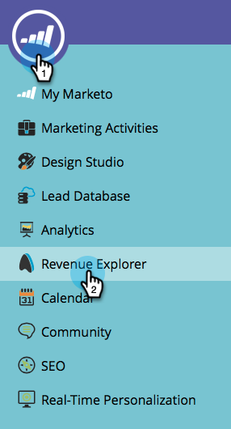
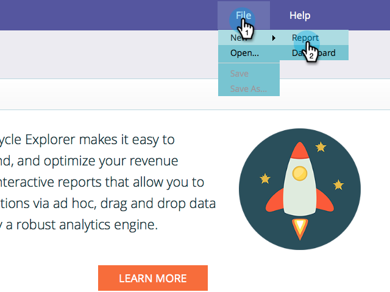
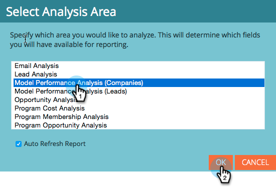
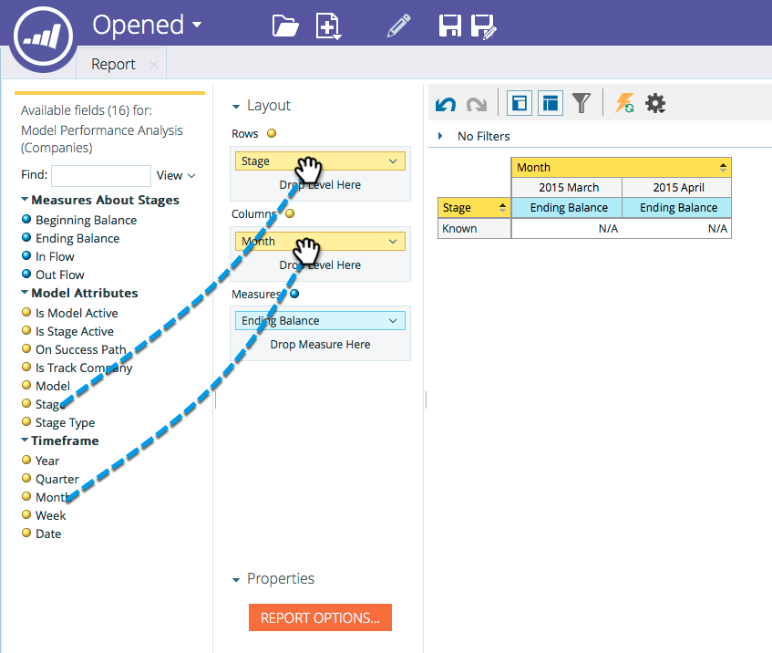

# 収益モデラーでの顧客別トラッキングの開始 {#start-tracking-by-account-in-the-revenue-modeler}

収益ステージモデラーと[!UICONTROL 収益エクスプローラー]を使用すると、リードとアカウントがモデル内を進行するにつれて、そのパフォーマンスを把握できます。

>[!NOTE]
>
>承認されたモデルの成功パスにステージがあり、「**顧客別トラッキングの開始**」がオンになっていることを確認します

1. 有用なデータを収集するのに十分な時間が経過したら、**[!UICONTROL My Marketo ホーム]**&#x200B;で&#x200B;**収益エクスプローラー**&#x200B;を選択します。

   

1. 新しいレポートを作成するには、「**[!UICONTROL ファイル]**」をクリックして&#x200B;**[!UICONTROL 新規作成]**／**[!UICONTROL レポート]**&#x200B;を選択します。

   

1. 「**[!UICONTROL モデル効果分析（会社）]**」を分析領域として選択し、「**[!UICONTROL OK]**」をクリックします。

   

1. **[!UICONTROL ステージ]**、**[!UICONTROL 月]**、**[!UICONTROL 期末残高]**&#x200B;各フィールドをドラッグして、月ごとのモデル内での会社の進行を表示することをお勧めします。 フィルターを使用して、目的の月を選択します。

   

1. レポートの設定が完了したら、**[!UICONTROL Is Track Company]**&#x200B;を右クリックし、**[!UICONTROL Filter]**&#x200B;を選択します。 これを使用して、レポートを&#x200B;**顧客別トラッキング**&#x200B;が選択されているステージに限定します。

   

1. 表示されるダイアログで、「**[!UICONTROL はい]**」を選択し、中央にある右向き矢印をクリックします。 これにより、「顧客別トラッキング」が有効なステージのみがフィルタリングされます。 完了したら、**[!UICONTROL OK]**&#x200B;をクリックします。

   

1. これで、アカウント別に追跡しているステージのみがレポートに表示されるようになります。 後で使用できるように、レポートを保存してください。 これをマーケティング活動の成功の別の尺度として使用できます。
