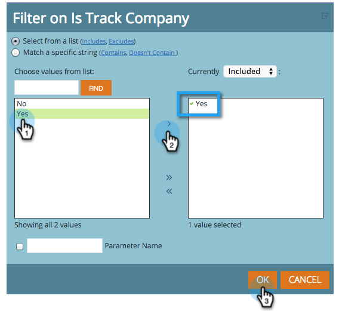

# 収益モデラーでの顧客別トラッキングの開始 {#start-tracking-by-account-in-the-revenue-modeler}

収益ステージモデラーと収益エクスプローラーを使用すると、リードと顧客がモデル内を進行するにつれて、その効果を把握できます。

>[!NOTE]
>
>承認されたモデルの成功パスにステージがあり、「**顧客別トラッキングの開始**」がオンになっていることを確認します

1. 有用なデータを収集するのに十分な時間が経過したら、**My Marketo ホーム**&#x200B;で&#x200B;**収益エクスプローラー**&#x200B;を選択します。

   

1. 新しいレポートを作成するには、「**ファイル**」をクリックして&#x200B;**新規作成**／**レポート**&#x200B;を選択します。

   

1. 「**モデル効果分析（会社）**」を分析領域として選択し、「**OK**」をクリックします。

   

1. **ステージ**、**月**、**期末残高**&#x200B;各フィールドをドラッグして、月ごとのモデル内での会社の進行を表示することをお勧めします。フィルターを使用して、目的の月を選択します。

   

1. レポートの設定が完了したら、「**追跡会社**」を右クリックして、「**フィルター**」を選択します。これを使用して、レポートを&#x200B;**顧客別トラッキング**&#x200B;が選択されているステージに限定します。

   

1. 表示されるダイアログで、「はい」を選択し、中央にある右向き矢印をクリックします。これにより、「顧客別トラッキング」が有効なステージのみがフィルタリングされます。完了したら、「**OK**」をクリックします。

   

1. これで、レポートには、顧客別に追跡しているステージのみが表示されます。後で使用できるように、レポートを保存してください。これをマーケティング活動の成功の別の尺度として使用できます。
