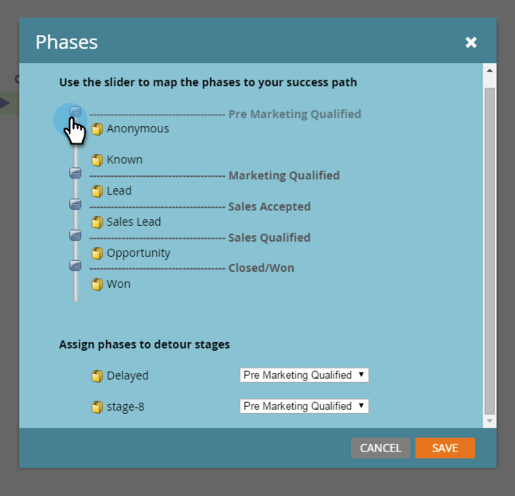

# 収益モデルのフェーズについて {#understanding-revenue-model-phases}

フェーズは、複数のステージをグループ化する方法です。モデル内の複数のステージが、ファネルの 1 つのフェーズを反映している場合があります。

## モデルのフェーズを定義する {#define-the-phases-of-the-model}

1. 「**フェーズ**」をクリックします。

   

1. 青いボタンをクリックして、ステージ間でフェーズを上下にドラッグします。

   
