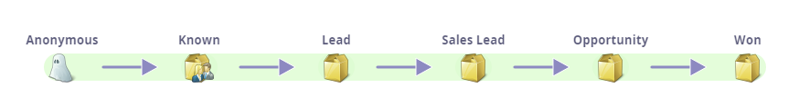
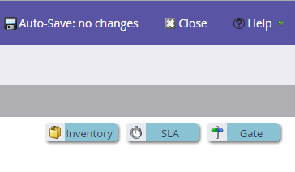
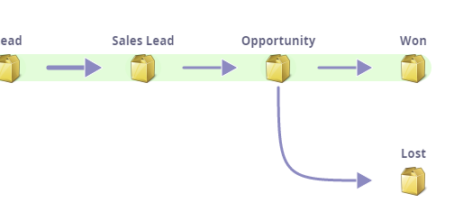

# 収益モデルについて {#understanding-revenue-models}

収益サイクルモデルは、マーケティングを次のレベルに進めます。 リードと最初に接点を持った時点から、そのリードが顧客として獲得されるまで、収益ファネル全体のすべてのステージをモデル化します。

## メンタルモデル（これについての考え方） {#mental-model-how-to-think-about-this-thing}

Modeler は、一連の水が入ったバケツのようなものです。 バケツの底には穴が開いており、

Modeler は、水（リード）が 1 日にバケツに入る量と穴から出る量を測定します （複数の穴がある場合があります）。

Modeler はすべて、任意の時点でのバケツ内のリード数を測定します。 これを、ステージバランスと呼びます。

>[!TIP]
>
>財務的な考え方に慣れている方は、各ステージを、日々お金が出入りし、毎日の終わりに残高が出る口座のようなものと考えることができます。

モデルは、通常、スマートキャンペーンとプログラムに慣れていて分析を次のレベルに進めたいと考えているお客様向けです。

## 新しいモデルの使用を開始する {#starting-with-a-new-model}

デフォルトでは、新しいモデルは 6 つの収益ステージで開始されます。 このモデルは、実際にはそのままでも問題ありませんが、深くカスタマイズできます。

すべて緑色の背景に表示されています。 これは、**成功パス**&#x200B;と呼ばれます。 成功パスについて詳しくは、[こちら](/help/marketo/product-docs/reporting/revenue-cycle-analytics/revenue-cycle-models/understanding-revenue-model-success-path.md)を参照してください。

**ステージ**&#x200B;は、リードの目標に向けた進行のマイルストーンです。

**トランジション**&#x200B;は矢印として表示され、リードがステージ間をどのように移動するかを制御します。

>[!NOTE]
>
>匿名ステージは特別です。 Web サイトを訪問する人全員ですが、実際誰なのかが不明です。 このステージは変更できません。

## カスタマイズ {#customization}

各社はそれぞれ異なります。 右上からドラッグして、モデルに要素を追加できます。

## 在庫ステージ {#inventory-stage}

これは箱のようなもので、最も基本的なステージです。 分析は、このステージの流入、流出およびバランスを追跡します。

## SLA ステージ {#sla-stage}

**サービスレベル契約**&#x200B;ステージの略です。 ここでの目的は、一部のステージで時間制限を適用することです。

>[!NOTE]
>
>**例**
>
>リードが「お問い合わせ」フォームに入力し、営業担当にアラートを送信する場合、72 時間の SLA が必要な場合があります。 違反を追跡し、良いリードを逃がした担当者を叱咤することができます。

## ゲートステージ {#gate-stage}

ゲートステージは、リードを複数の選択肢の 1 つにフィルタリングする場合に使用します。 これは高度なオプションです。 初心者はゲートを避けるべきです。

>[!NOTE]
>
>**例**
>
>ゲートは、通常のプロセスから切り離すために&#x200B;**重点顧客リスト**&#x200B;の一部であるリードに対して使用することができます。

## トランジション {#transitions}

スマートキャンペーンを使用してリードがステージ間を移動する方法を正確に明確にし、リードがどのステージにも留まらないようにします。 トランジションには、必ずトリガーフィルターを使用してください（これは評価方法です）。

>[!NOTE]
>
>**例**
>
>トランジションは、リードがフォームに入力することによって定義できます。

ハッピーな成功パスから外れた位置へのステージの追加

「負け」は追加するのに良いものですが、緑の道の上にはありません。 これは、「成功」ではないからです。

>[!MORELIKETHIS]
>
>* [新規収益モデルの作成](/help/marketo/product-docs/reporting/revenue-cycle-analytics/revenue-cycle-models/create-a-new-revenue-model.md)
>
>* [収益モデル在庫ステージの使用](/help/marketo/product-docs/reporting/revenue-cycle-analytics/revenue-cycle-models/using-revenue-model-inventory-stages.md)
>
>* [収益モデルゲートステージの使用](/help/marketo/product-docs/reporting/revenue-cycle-analytics/revenue-cycle-models/using-revenue-model-gate-stages.md)
>
>* [収益モデル SLA ステージの使用](/help/marketo/product-docs/reporting/revenue-cycle-analytics/revenue-cycle-models/using-revenue-model-sla-stages.md)
>
>* [収益モデルのレポート](/help/marketo/product-docs/reporting/revenue-cycle-analytics/revenue-cycle-models/report-on-your-revenue-model.md)
>
>* [収益モデルの承認／未承認](/help/marketo/product-docs/reporting/revenue-cycle-analytics/revenue-cycle-models/approve-unapprove-a-revenue-model.md)
