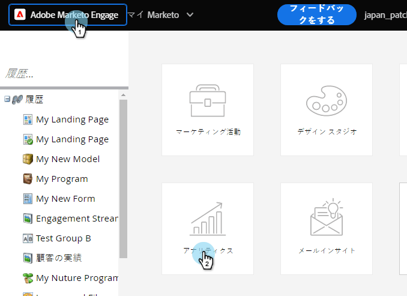
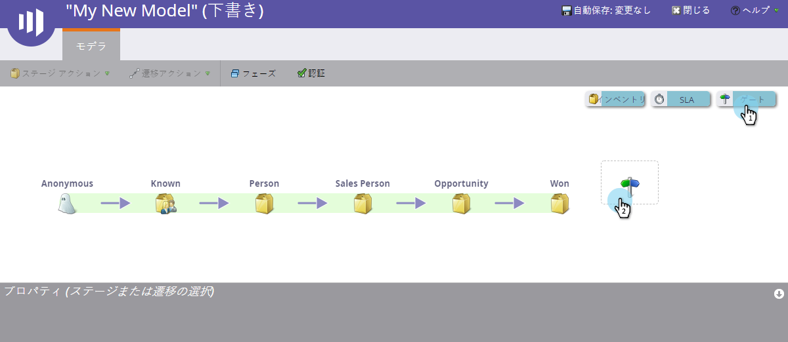
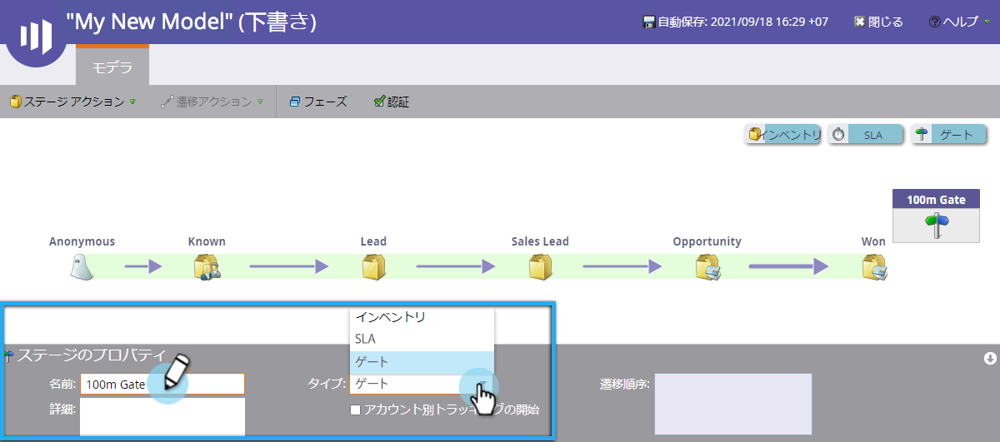
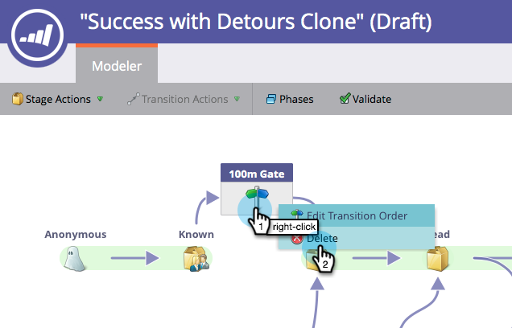
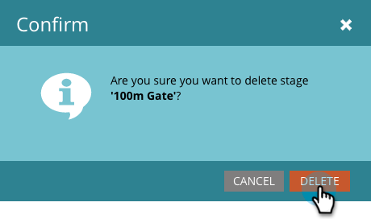

# 売上高モデルのゲートステージの使用{#using-revenue-model-gate-stages}

ゲートステージは資格チェックの役割を果たします。

>[!TIP]
>
>グラフィックやプレゼンテーションプログラムで練習用のモデルを作成し、それを同僚に確認してもらうのは良いアイデアです。

## 追加ゲートステージ{#add-a-gate-stage}

1. 「**Analytics**」領域に移動します。

   

1. 既存のモデルを選択するか、[新しいモデルを作成](create-a-new-revenue-model.md)します。

   

1. 「**編集** **ドラフト**」をクリックします。

   

1. 「**ゲート**」ボタンをクリックし、カンバスの任意の場所にドラッグ&amp;ドロップします。

   

1. **Name **を編集し、**Type**&#x200B;を選択します。

   >[!NOTE]
   >
   >この時点で、「アカウント別開始トラッキング[」を選択して、モデルを進める際のアカウントのパフォーマンスを把握します。](start-tracking-by-account-in-the-revenue-modeler.md)

   

>[!NOTE]
>
>ゲートステージは、トランジションルールに入力した基準に基づいてリードを分割します。**リード**&#x200B;を保持しません。 他のトランジションが選択しないリードがデフォルトのトランジションを通るように、デフォルトの選択が必要です。

## ゲートステージの編集{#edit-a-gate-stage}

「名前」、「説明」を編集し、Gateステージのタイプを調整します。 アカウント](start-tracking-by-account-in-the-revenue-modeler.md)による[開始追跡をオプトすることもできます。

1. **ゲート**&#x200B;ステージアイコンをクリックします。

   

1. 「**名前**」フィールドと「**説明**」フィールド内をクリックして、内容を編集します。

   

1. 編集する&#x200B;**タイプ**&#x200B;ドロップダウンを選択します。

   

## ゲートステージ{#delete-a-gate-stage}を削除

1. ゲートステージアイコンを右クリックし、「**削除**」を選択して、ゲートステージを削除できます。

   

1. また、ゲートステージをクリックして削除し、**ステージアクション**&#x200B;ドロップダウンで&#x200B;**削除**&#x200B;を選択して削除することもできます。

   

1. どちらの削除方法を使用する場合も、選択を確認するメッセージが表示されます。 「**削除**」をクリックします。

   

おめでとう！ ゲート・ステージの素晴らしい世界を理解して頂けます

>[!MORELIKETHIS]
>
>* [売上高モデル在庫ステージの使用](using-revenue-model-inventory-stages.md)
>* [売上高モデルのSLAステージの使用](using-revenue-model-sla-stages.md)
>* [新しい売上高モデルの作成](create-a-new-revenue-model.md)。

>

