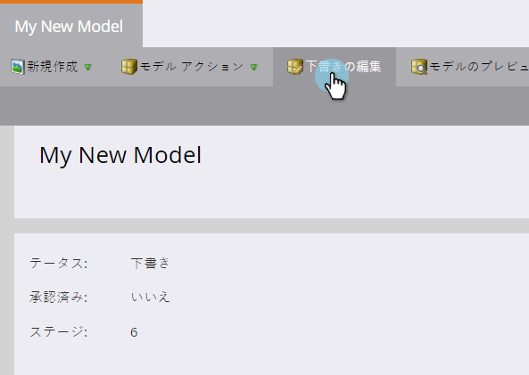
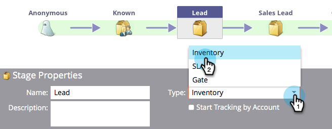

# 売上高モデル在庫ステージの使用 {#using-revenue-model-inventory-stages}

既知のリードとアカウントはすべて、最初は在庫ステージにあります。 この見込み客プールは、販売準備が整うまでリードが育成される場所です。 在庫ステージに期限はありません。

>[!TIP]
>
>グラフィックやプレゼンテーションプログラムで練習用のモデルを作成し、まず同僚に確認してもらうのが良いアイデアです。

## 追加在庫段階 {#add-an-inventory-stage}

1. 新しい売上サイクルモデルの在庫ステージを追加するには、 **マイマーケティング** ホーム画面の「 **Analytics** 」ボタンをクリックします。

   

1. 「 **Analytics** 」セクションで、既存のモデルを選択するか、新しいモデルを [作成します](create-a-new-revenue-model.md)。

   

1. 「ドラフト **を編集**」をクリックします。

   

1. 新しい在庫ステージを追加するには、「 **在庫** 」ボタンをクリックし、キャンバス内の任意の場所にドラッグ&amp;リリースします。

   

1. ステージを追加した後は、自由に名前を編集したり、説明を追加したり、タイプを調整したりできます。 現時点では、「アカウント別** [開始追跡」](start-tracking-by-account-in-the-revenue-modeler.md)**を選択することもできます。

   

## 在庫ステージの編集 {#edit-an-inventory-stage}

在庫アイコンを選択すると、 **名前**、 **説明の追加** 、 ****&#x200B;タイプの調整を行うことができます。 「アカウント別 [開始追跡」も選択できます](start-tracking-by-account-in-the-revenue-modeler.md)。

1. 在庫アイコンをクリックします。

   

1. 「 **名前** 」フィールドと「 **説明** 」フィールド内をクリックして、内容を編集します。

   

1. 編集する **タイプ** (Type)プルダウンを選択します。

   

## 在庫ステージの削除 {#delete-an-inventory-stage}

1. 在庫ステージは、右クリックするか、コントロールして在庫ステージアイコンをクリックすることで削除できます。

   

1. また、ステージをクリックして削除し、「 **ステージのアクション** 」ドロップダウンで「 **削除**」を選択することもできます。

   

1. どちらの削除方法を使用する場合も、選択を確認するメッセージが表示されます。 「 **削除**」をクリックします。

   

おめでとう！ これで、在庫段階の素晴らしい世界がわかりました。
