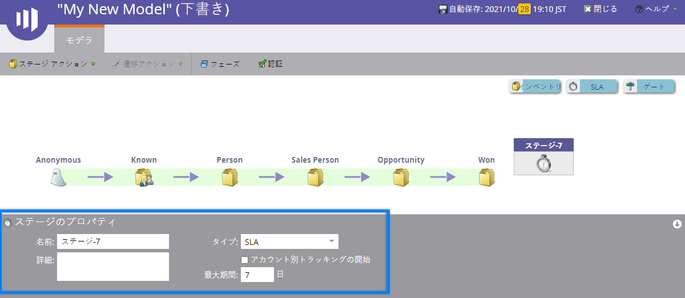

# 売上高モデルのSLAステージの使用{#using-revenue-model-sla-stages}

SLAは、「サービス・レベル・アグリーメント」の略です。 これらのステージは、プロセスの前または後に進む前にリードを評価または処理する必要がある、定義済みの最大時間がある場合に使用されます。

>[!TIP]
>
>グラフィックやプレゼンテーションプログラムで練習用のモデルを作成し、それを同僚に確認してもらうのは良いアイデアです。

## 追加SLAステージ{#add-an-sla-stage}

1. 新しい売上サイクルモデルのSLAステージを追加するには、マイマーケティングホーム画面の&#x200B;**Analytics**&#x200B;ボタンをクリックします。

   

1. 「解析」セクションで、既存のモデルを選択するか、[新しいモデルを作成](create-a-new-revenue-model.md)します。

   

1. 「**ドラフトを編集**」をクリックします。

   

1. 新しいSLAステージを追加するには、**SLA**&#x200B;ボタンをクリックし、キャンバス内の任意の場所にドラッグして解放します。

   

1. **名前**&#x200B;を自由に編集し、**説明**&#x200B;を追加して、ステージを追加した後で&#x200B;**タイプ**&#x200B;を調整できます。 現時点では、「アカウント別開始追跡」を「** [アカウント別追跡」に選択することもできます。](start-tracking-by-account-in-the-revenue-modeler.md)**

   

## SLAステージの編集{#edit-an-sla-stage}

SLAステージアイコンを選択した場合は、名前を編集し、説明を追加して種類を調整できます。 また、「アカウント別開始追跡[」を選択することもできます。](start-tracking-by-account-in-the-revenue-modeler.md)

1. SLAステージアイコンをクリックします。

   

1. 「**名前**」フィールドと「**説明**」フィールド内をクリックして、内容を編集します。

   

1. 編集する&#x200B;**「タイプ**」プルダウンを選択します。

   

## SLAステージの削除{#delete-an-sla-stage}

1. SLAステージは、右クリックするか、コントロールしてSLAステージアイコンをクリックすることで削除できます。

   

1. また、ステージをクリックして削除し、「ステージのアクション」ドロップダウンで「削除」を選択することもできます。

   

