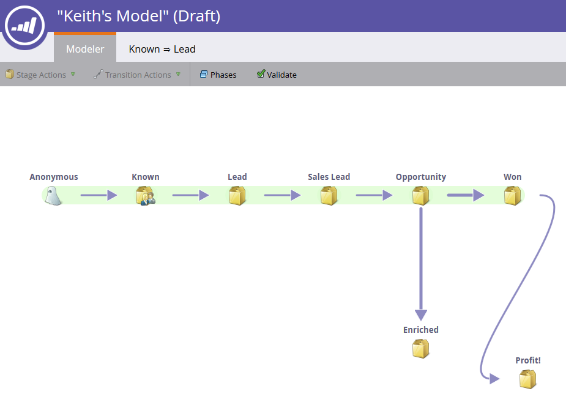
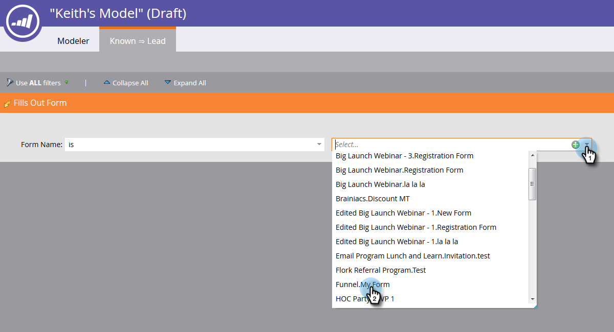
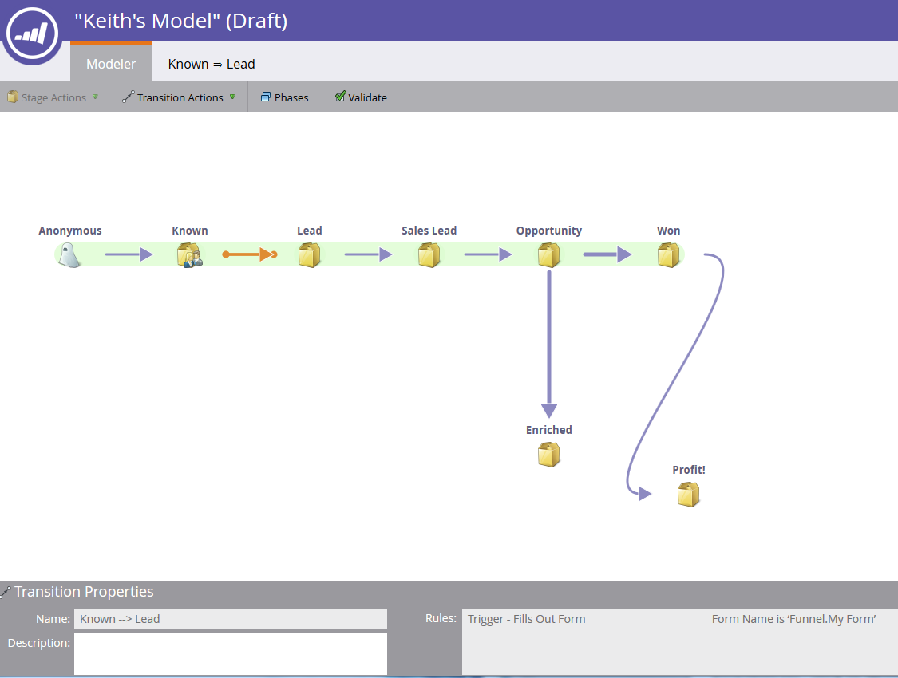

# 収益モデルのトランジションを使用する {#using-revenue-model-transitions}

>[!PREREQUISITES]
>
>[収益モデルの新規作成](/help/marketo/product-docs/reporting/revenue-cycle-analytics/revenue-cycle-models/create-a-new-revenue-model.md)

モデルを作成し、在庫ステージを選択して整理したら、次は移行を設定します。

1. 矢印の 1 つを右クリック（ダブルクリックも可能）し、「**[!UICONTROL トランジションを編集]**」を選択します。

   

   >[!NOTE]
   >
   >「[!UICONTROL 匿名]⇒[!UICONTROL 既知]」トランジションルールは編集できません。

1. 選択したトランジションについて、新しいタブが開きます。

   

1. トランジションは、リードがステージ間をどのように移動するかを制御します。 右側から選択したトリガー（またはフィルター）をドラッグし、キャンバス上で放します。 この例では、「**[!UICONTROL フォームへの記入]**」トリガーを選択します。

   >[!TIP]
   >
   >収益モデラがレポート用に設定されているので、トリガーを常に含めることをお勧めします。 そうすれば、モデルとステージフローの真の速度がレポートに反映されます。 フィルターをトリガーと共に追加して、追加の制約を設定できます。

   

1. 選択したトリガーまたはフィルターのパラメーターを選択します。

   

1. モデルに戻るには、「**[!UICONTROL Modeler]**」をクリックします。

   

1. 画面の下部に、トランジションのルールが表示されます。

   

1. すべてのトランジションについてルールを設定したら、「**[!UICONTROL 認証]**」をクリックして検証します。

   

1. 検証で問題がなければ、以下のメッセージが表示されます。

   

お疲れ様です。 モデルのトランジションが正常に変更されました。

>[!MORELIKETHIS]
>
>[収益モデルの承認／未承認](/help/marketo/product-docs/reporting/revenue-cycle-analytics/revenue-cycle-models/approve-unapprove-a-revenue-model.md)
