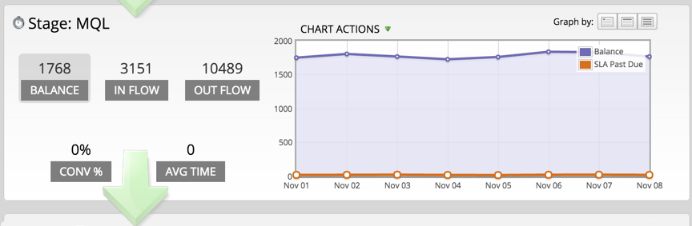

# 成功パスアナライザの使用{#using-the-success-path-analyzer}

成功パスアナライザーを使用して、[売上高サイクルモデル](understanding-revenue-models.md)の段階を通して訪問者のフロー（量）と速度（日単位の速度）の両方を反映した具体的な詳細を調べます。

>[!PREREQUISITES]
>
>[成功パスアナライザーの作成](create-a-success-path-analyzer.md)

1. **Analytics**&#x200B;に移動し、**成功パスアナライザー**&#x200B;を選択します。

   

   右側のグラフは、選択したボタンのデータを左側に反映します。 デフォルトでは、これは「バランス」です。

1. 「フロー&#x200B;**内**」をクリックして、選択した期間にステージに入った訪問者数をグラフ化します。

   

   * 「アウトフロー」をクリックして、ステージを退出した人数をグラフ化します。
   * 「コンバージョン率」をクリックして、コンバージョン率をこのステージから次のステージにグラフ化します。
   * 「平均時間」をクリックして、このステージに費やした人が次のステージに移るまでの時間を確認します。

1. **グラフのアクション**/期間の比較をクリックして、同じ長さの異なる期間とデータを比較します。

   

1. 比較期間の&#x200B;**開始日**&#x200B;を選択します。

   

   **終了日**&#x200B;は、元の期間の長さに合わせて自動的に設定されます。

1. 「**比較**」をクリックします。

   

1. グラフは、比較期間中に重複するデータで更新されます（緑色）。

   

1. グラフの時間スケールを変更するには、**[**&#x200B;でグラフ]ボタンの1つをクリックします。daily（デフォルト）、weeklyおよびmonthly

   

1. SLA(Service-Level Agreement)を使用するステージの場合、**グラフの操作**/*期限切れのSLAを表示**をクリックすると、指定した期間内にSLAターゲットを見逃したすべての人に表示されます。

   

1. グラフは、各ノードで発生したSLAの数をオレンジ色で示して更新されます。

   

   オレンジ色で表示される人は、*または*&#x200B;でない人がSLAの段階に残っている可能性があります。

1. **グラフの操作** >**期限切れのSLAターゲットを表示**をクリックすると、指定した期間の終わりにSLA段階にあるSLAの期限切れのユーザーを含むすべてのユーザーが表示されます。

   

1. グラフが更新され、各ノードで期限切れにされたSLAの数がオレンジ色で表示されます。

   

1. 特定のノード（日付）上のデータポイントの具体的な詳細を読み取るには、バブルの上にカーソルを置きます。

   

1. グラフを印刷するには、** ****グラフの操作** > **グラフを印刷**&#x200B;をクリックします。

   

解析は、モデル内での移動を理解するのに役立ちます。 進歩を進めるにつれて、これはマーケティング活動の戦略化に非常に重要な役割を果たします。
