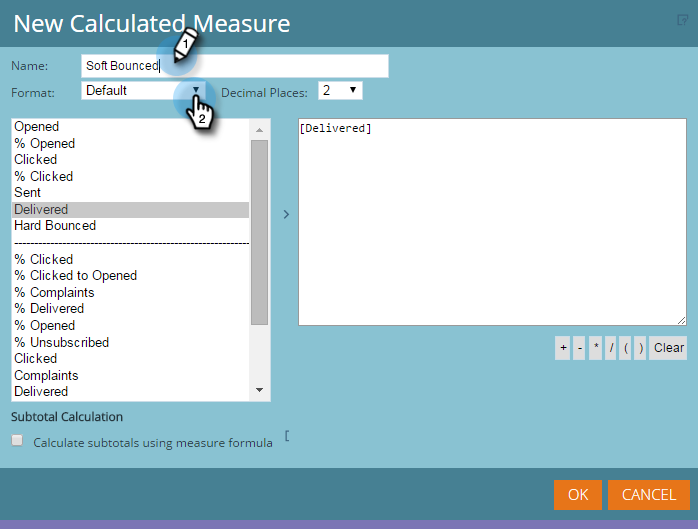
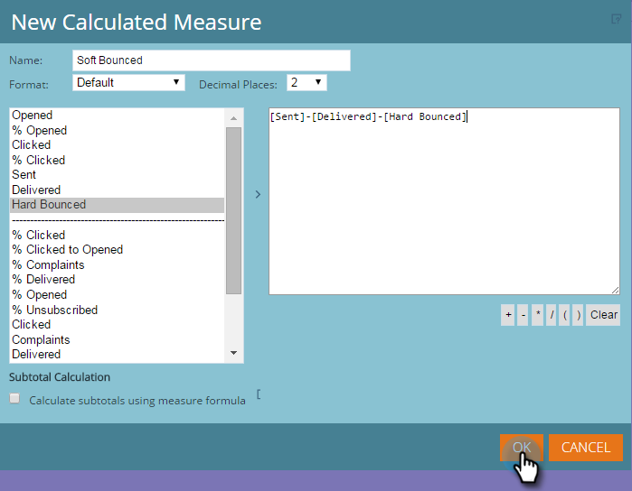
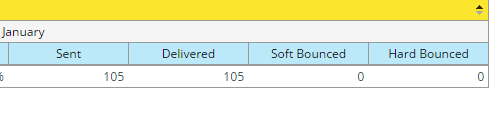

# 収益エクスプローラーレポートへのカスタム測定の追加 {#adding-custom-measures-to-a-revenue-explorer-report}

レポートにカスタムの測定が必要な場合があります。自分で簡単に作成できます。

以下の例では、ソフトバウンスについて計算した測定を作成しています。レポートの既存の指標を取得し、基本的な数学を用いて新しい指標を作成します。他のタイプの測定も作成できます。

>[!PREREQUISITES]
>
>レポートには 1 つ以上の指標が必要ですが、カスタム測定を定義する際に使用する測定の 1 つである必要はありません。

1. レポートに必要なフィールドを取り込みます。詳しくは、[収益エクスプローラーレポートへのフィールドの追加](/help/marketo/product-docs/reporting/revenue-cycle-analytics/revenue-explorer/adding-fields-to-a-revenue-explorer-report.md)を参照してください。

1. 既存の指標（青色のセル）を右クリックし、「**[!UICONTROL ユーザー定義の測定]**」をクリックして、「**[!UICONTROL 計算済み測定]**」を選択します。

   

1. カスタム測定に名前を付け、形式を選択します。

   

1. 左側の必要な項目をクリックし、矢印をクリックして上に移動します。必要に応じて数学シンボルを追加します。

   

   >[!TIP]
   >
   >数学シンボルは、自分で入力するか、選択ボックスを使用します。

1. 完了したら、「**[!UICONTROL OK]**」をクリックします。

   

   新しいカスタム測定が、レポートに新しい列として表示されます。

   

   >[!MORELIKETHIS]
   >
   >[収益エクスプローラーレポートへのフィールドの追加](/help/marketo/product-docs/reporting/revenue-cycle-analytics/revenue-explorer/adding-fields-to-a-revenue-explorer-report.md)
