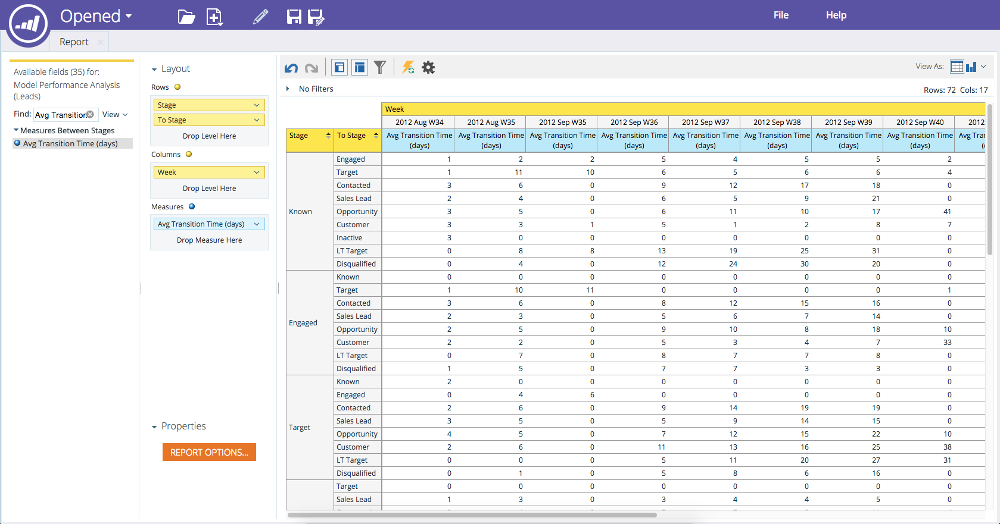

# 売上高エクスプローラーレポートへのフィールドの追加 {#adding-fields-to-a-revenue-explorer-report}

ディメンションフィールドと指標フィールドをキャンバスにドラッグ&amp;ドロップして、売上高エクスプローラーレポートをカスタマイズします。

<table> 
 <tbody> 
  <tr> 
   <th>フィールドのタイプ</th> 
   <th>説明</th> 
  </tr> 
  <tr> 
   <td>黄色のフィールドまたはディメンション</td> 
   <td>
黄色のフィールドは、レポートのディメンション（行と列）です。

例えば、リードステータスや作成日を列で表示するレポートを設定できます。
</td> 
  </tr> 
  <tr> 
   <td>青いフィールドまたは測定</td> 
   <td>
青いフィールドは、データで分析される指標です。

例えば、リードの平均リードスコアや、リードが商談を持った日数などです。
</td> 
  </tr> 
 </tbody> 
</table>

1. 使用する黄色いフィールドを見つけ、行にドラッグします。

   

   >[!TIP]
   >
   >フィールドの上にカーソルを置くと、完全な説明が表示されます。

1. 使用する青いフィールドを見つけ、測定にドラッグします。

   

   これで完了です。本格的なレポートの完成です。

   

>[!MORELIKETHIS]
>
>[売上高エクスプローラーレポートのフィールドの削除](/help/marketo/product-docs/reporting/revenue-cycle-analytics/revenue-explorer/deleting-a-field-in-a-revenue-explorer-report.md)
