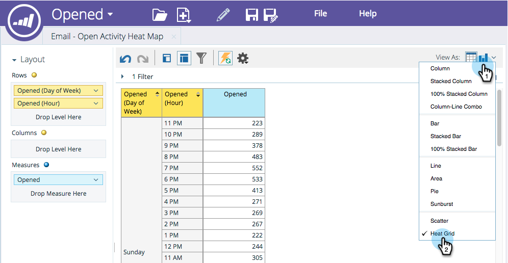
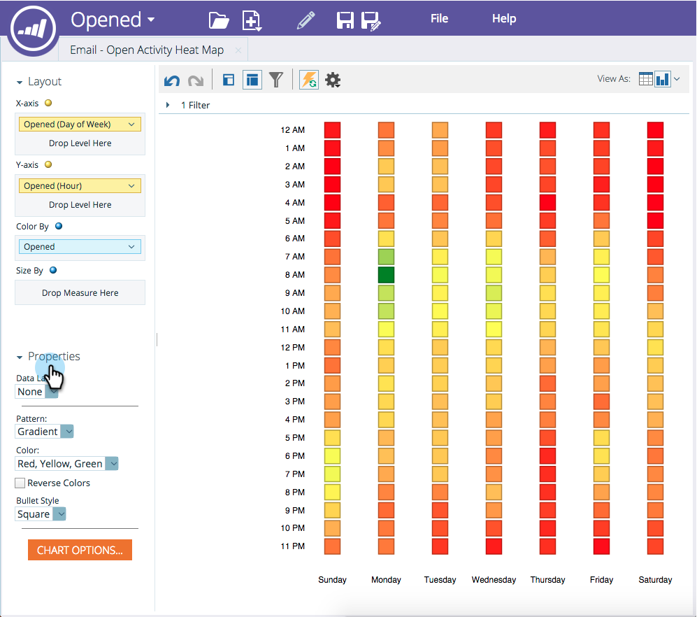

# 熱グリッドのカスタマイズと表示 {#customize-and-display-heat-grids}

ヒートグリッドは、データを色付きのグリッドで視覚的に表し、良いパターンと悪いパターンをより簡単かつ迅速に識別できます。

1. レポート内で、グラフアイコンをクリックし、「 **ヒートグリッド**」をクリックします。

   

1. 「 **熱グリッド」(Heat Grid**)に変更を加えるには、「**プロパティ**」領域に移動します。

   

   すごい！ これで **熱格子**!

