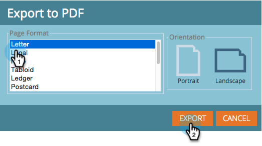

# 売上高エクスプローラ・レポートのエクスポート {#exporting-a-revenue-explorer-report}

売上高エクスプローラレポートをエクスポートして、誰とでも共有できます。

1. 歯車アイコンをクリックし、「 **書き出し** 」を選択して、ファイル形式を選択します。

   

   >[!NOTE]
   >
   >レポートは次の3つの形式にエクスポートできます。
   >
   >    
   >    
   >    * PDF
   >    * Excel
   >    * CSV

1. 「 **ページの形式** 」および「 **向き**」を選択し、「書き出し ****」をクリックします。

   

   甘い！ このファイルを送り、忍者のようなマーケティングスキルで仲間に印象を与えます。

>[!NOTE]
>
>**関連記事**
>
>* [売上高エクスプローラレポートの購読](subscribe-to-a-revenue-explorer-report.md)

>

