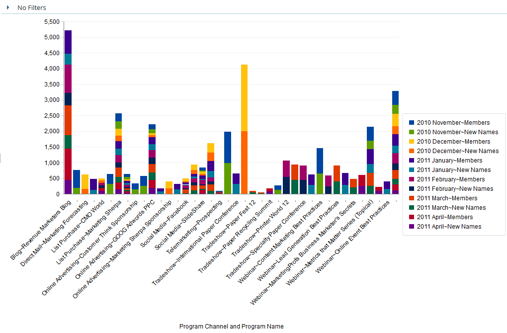
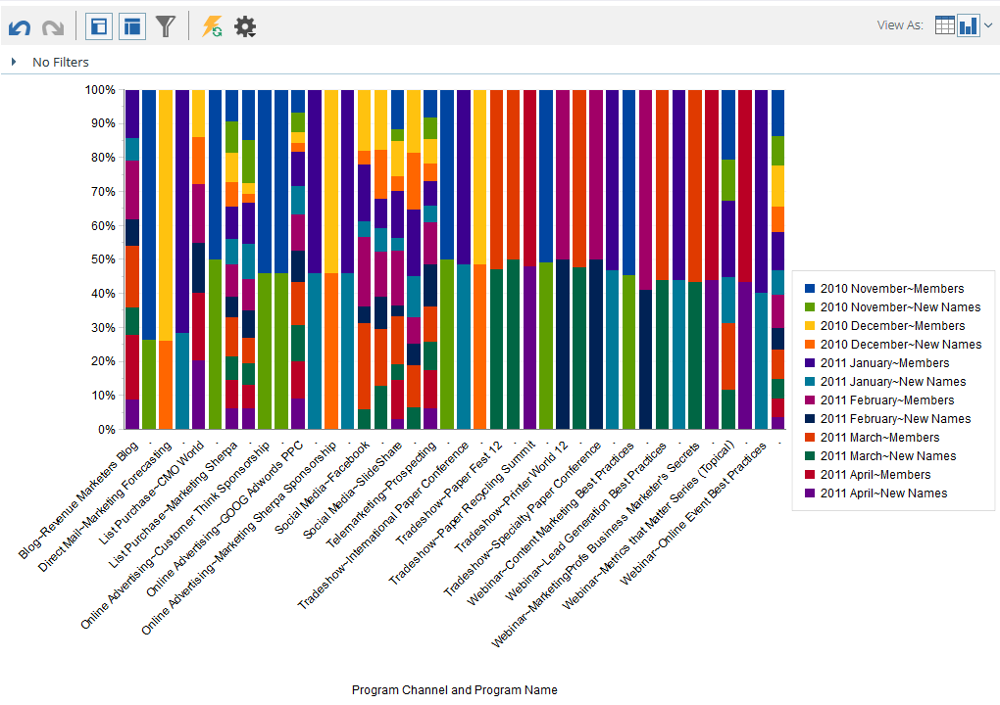

# 売上高エクスプローラからの結果のグラフ化 {#graphing-results-from-revenue-explorer}

デフォルトでは、売上高エクスプローラのレポートは表として表示されます。 また、結果を様々な形式のグラフとして表示するオプションもあります。

1. レポートの[ **表示** ]ドロップダウンメニューにある矢印をクリックします。 異なるグラフオプションが表示されます。

   

## グラフの例 {#graph-examples}

**列**:テーブルの各行と各列が垂直列として表示されます。

**積み重ね縦棒**:テーブルの各行のグラフ内には1つの列があります。

**100%積み重ね縦棒**:テーブルの各行は、グラフ内に1つの列を持ち、100%に拡大・縮小されます。

**行**:各列は1行に、各行は1行にデータポイントとして表示されます。

**列行コンボ**:列グラフと折れ線グラフの組み合わせ。

**バー**:テーブルの各行と各列が横棒として表示されます。

**積み重ね棒グラフ**:テーブルの各行は、グラフ内に1行あります。

**100%積み重ね棒グラフ**:テーブルの各行は、グラフ内に1行あり、100%に拡大・縮小されます。

**面積**:データは積み重ね棒グラフに似ていますが、埋め込まれています。

**円グラフ**:各列は円グラフで表示され、各行はスライスとして表示されます。

**サンバースト**:スライスの属性を表す放射状グラフ。

**散布**:使用する属性に基づいてバブルが作成されます。 メジャーを使用して、吹き出しに色分けしたり、サイズを指定したりします。

**熱グリッド**:色と形状をカスタマイズして、ポジティブとネガティブのパフォーマンスパターンを特定します。

1. テーブル表示に戻すには、テーブルボタンをクリックします。

   

