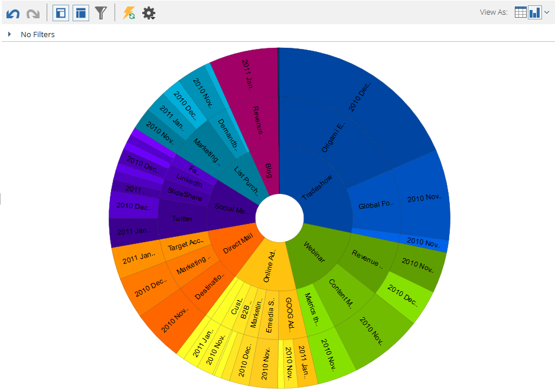

# [!UICONTROL &#x200B; 収益エクスプローラー &#x200B;] からのグラフ結果 {#graphing-results-from-revenue-explorer}

デフォルトでは、[!UICONTROL &#x200B; 収益エクスプローラー &#x200B;] のレポートはテーブルとして表示されます。 また、結果を様々な形式のグラフとして表示するオプションもあります。

1. レポートの&#x200B;**[!UICONTROL 表示形式]**&#x200B;ドロップダウンメニューで矢印をクリックします。異なるグラフオプションが表示されます。

   

## グラフの例 {#graph-examples}

**[!UICONTROL 列]**：テーブル内の各行と各列が、垂直列として表示されます。

**[!UICONTROL 積み重ね列]**：テーブルの各行のグラフには 1 つの列があります。

**[!UICONTROL 100% 積み重ね列]**：テーブルの各行のグラフには 1 つの列があり、100% に拡大・縮小されます。

**[!UICONTROL 線]**：各列は行として表示され、各行は行上のデータポイントとして表示されます。

**[!UICONTROL 列行コンボ]**: [!UICONTROL &#x200B; 列 &#x200B;] グラフと [!UICONTROL &#x200B; 行 &#x200B;] グラフの組み合わせ。

**[!UICONTROL 棒グラフ]**：テーブルの各行と各列が横棒として表示されます。

**[!UICONTROL 積み重ね棒グラフ]**：テーブルの各行のグラフには 1 つの行があります。

**[!UICONTROL 100% 積み重ね棒グラフ]**：テーブルの各行のグラフには 1 行が含まれ、100% に拡大・縮小されます。

**[!UICONTROL 領域]**：データは積み重ね棒グラフに似ていますが、塗りつぶされて表示されます。

**[!UICONTROL 円グラフ]**：各列は円グラフで表示され、各行はスライスとして表示されます。

**[!UICONTROL サンバースト]**：スライスの属性を表す放射状グラフ。

**[!UICONTROL 散布図]**：使用する属性に基づくバブル。測定を使用して、バブルに色分けを適用したり、サイズを決定したりします。

**[!UICONTROL ヒートグリッド]**：色と形状をカスタマイズして、正と負のパフォーマンスパターンを識別します。

1. テーブル表示に戻すには、「テーブル」ボタンをクリックします。

   
