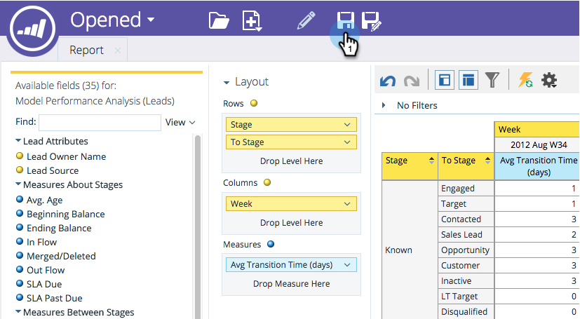

# 収益エクスプローラレポートの保存 {#saving-a-revenue-explorer-report}

収益エクスプローラレポートは、任意のファイルに保存できます。

1. 保存アイコンをクリックします。

   

   >[!NOTE]
   >
   >レポートに加えた変更は、自動的には保存されません。頻繁に保存してください。

1. レポートにわかりやすい名前を付け、場所を選択して、「**保存**」をクリックします。

   

   これだけです。「**ファイルを参照**」でファイルにアクセスできます。

   

>[!MORELIKETHIS]
>
>[収益エクスプローラレポートの購読](/help/marketo/product-docs/reporting/revenue-cycle-analytics/revenue-explorer/subscribe-to-a-revenue-explorer-report.md)
