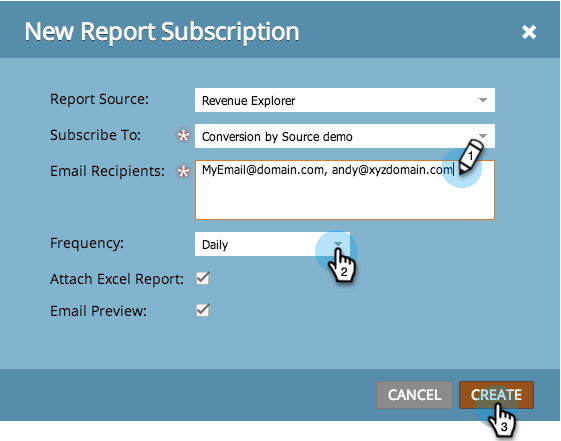
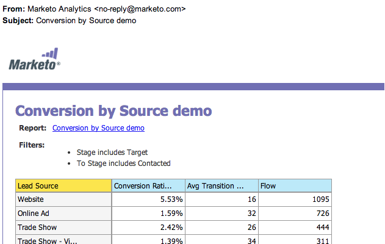

# 売上高エクスプローラレポートの購読 {#subscribe-to-a-revenue-explorer-report}

売上高サイクルエクスプローラの [レポートから更新を受け取り](http://docs.marketo.com/display/docs/revenue+cycle+analytics) 、それらを共有するには、既存のレポートに任意の電子メールアドレスを登録します。

1. 「 **Analytics** 」に移動し、 **新規/新しいレポート購読を選択します。**

   

   >[!NOTE]
   >
   >プログラムで作成した基本レポートを購読するには、「基本レポートの [購読」を参照してください。](../../../../product-docs/reporting/basic-reporting/report-subscriptions/subscribe-to-a-basic-report.md)

1. 「 **レポートソース**」で、「**売上高エクスプローラ**」を選択します。

   

1. フォルダツリーに移動し、レポートを選択します。

   

1. 電子メールアドレスを入力し、レポート電子メールの頻度を設定します。

   

   >[!NOTE]
   >
   >受信した電子メール内のレポートを誰でも登録解除できます。

1. 購読が設定された！ 自分の電子メールアドレスを含めると、レポートを電子メールで受信します。

   

>[!NOTE]
>
>**関連記事**
>
>すべてのレポート購読を1か所で [管理する方法](../../../../product-docs/reporting/basic-reporting/report-subscriptions/manage-report-subscriptions.md) 。

>[!NOTE]
>
>**ディープダイブ**
>
>Marketorの高度な分析機能で実行できる操作の詳細については、 [売上高サイクルエクスプローラ](http://docs.marketo.com/display/docs/revenue+cycle+analytics) （英語）を参照してください。

