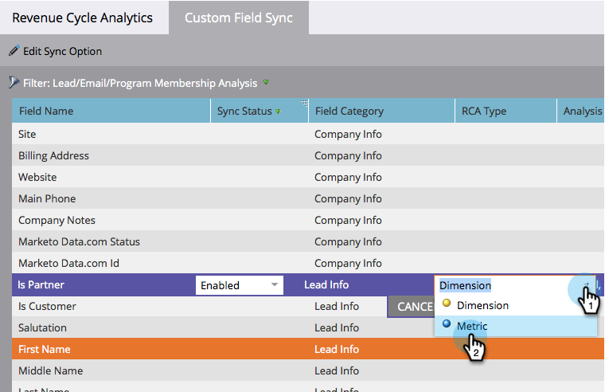

# カスタムフィールドを[!UICONTROL 収益エクスプローラー]に同期 {#sync-custom-fields-to-the-revenue-explorer}

[!UICONTROL 収益サイクル分析]では、カスタム Marketo フィールドに関するレポートを作成できるので、同期するカスタムフィールドを設定する必要があります。

>[!NOTE]
>
>**管理者権限が必要**

1. **[!UICONTROL 管理]**&#x200B;セクションに移動します。

   

1. 「**[!UICONTROL 収益サイクル分析]**」を選択します。

   

1. 「**[!UICONTROL カスタムフィールドの同期]**」タブをクリックし、分析エリアを選択します。

   

1. 同期を有効にするフィールドを選択し、「**[!UICONTROL 同期オプションを編集]**」をクリックします。

   

1. 「**[!UICONTROL 同期ステータス]**」を「**[!UICONTROL 有効]**」に変更します。

   

1. 任意の「**[!UICONTROL 収益サイクル分析タイプ]**」を選択し、「**[!UICONTROL 保存]**」をクリックします。

   

   >[!TIP]
   >
   >有効にすると、翌日に[!UICONTROL 収益サイクル分析]でデータを使用できるようになります。

   これで完了です。収益サイクル分析にカスタムフィールドを追加する方法を理解できました。
