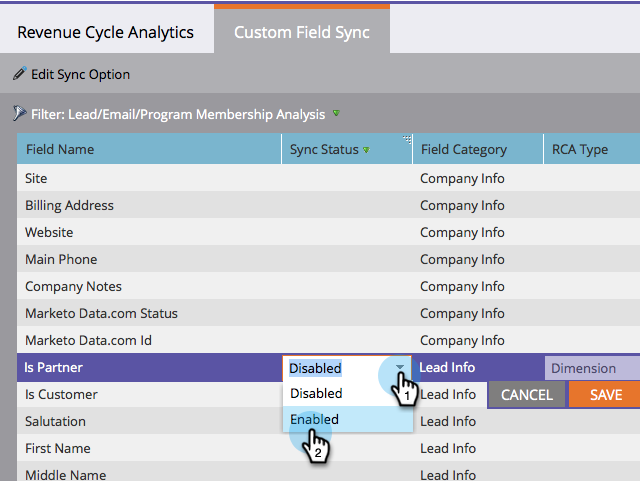

# カスタムフィールドを [!UICONTROL &#x200B; 収益エクスプローラー &#x200B;] に同期 {#sync-custom-fields-to-the-revenue-explorer}

[!UICONTROL &#x200B; 売上高サイクル分析 &#x200B;] では、カスタムデータフィールドについてレポートできます。そのためには、Marketoするカスタムフィールドを設定する必要があります。

>[!NOTE]
>
>**管理者権限が必要**

1. **[!UICONTROL 管理]**&#x200B;セクションに移動します。

   

1. 「**[!UICONTROL 収益サイクルアナリティクス]**」を選択します。

   

1. 「**[!UICONTROL カスタムフィールドの同期]**」タブをクリックし、分析エリアを選択します。

   

1. 同期を有効にするフィールドを選択し、「**[!UICONTROL 同期オプションを編集]**」をクリックします。

   

1. 「**[!UICONTROL 同期ステータス]**」を「**[!UICONTROL 有効]**」に変更します。

   

1. 任意の「**[!UICONTROL 収益サイクルアナリティクスタイプ]**」を選択し、「**[!UICONTROL 保存]**」をクリックします。

   

   >[!TIP]
   >
   >有効化すると、翌日に、データを [!UICONTROL &#x200B; 収益サイクル分析 &#x200B;] で利用できるようになります。

   これで完了です。収益サイクルアナリティクスにカスタムフィールドを追加する方法を理解できました。
