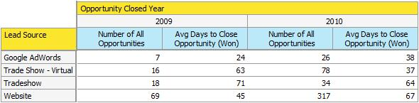

# 売上高エクスプローラーでの商談分析について {#understanding-opportunity-analysis-in-revenue-explorer}

売上高エクスプローラーで商談分析を使うと、商談をさらに詳しく調べることができます。リードや会社の属性、例えばリードのソースや地理情報に基づいてデータを細かく切り分け、名前、ステージ、可能性に基づいて商談の作成とクローズを分析します。マーケティングがパイプラインにどのくらい貢献しているかを確かめましょう。

## 分析の例 {#example-analysis}

次に、商談分析エリアで作成できるレポートをいくつか示します。

1. 創出された商談に対するマーケティングの影響

   マーケティングプログラムが影響を与えたパイプラインの割合は？このレポートが答えを示します。次の円グラフは、マーケティングプログラムによって獲得したすべての商談の数と商談の金額の割合を示しています。

   

1. 商談のクローズおよび成立に与えたマーケティングの影響。

   このレポートは、マーケティングによって獲得および影響を受けた売上高を、数字と数量別に表示します。

   

1. リードソース別クローズした商談

   このレポートは、クローズしたすべての商談の内訳をリードソース別に示し、機能しているソースと機能していないソースの概要を明確にします。

   

1. ソース別クローズまでの時間

   このレポートでは、商談がクローズするまでの平均日数と、リードのソースとの関係がわかります。

   

1. 有効な商談とステージ

   このレポートは、収益サイクルの各ステージで有効な商談の数を示しています。

   

1. 年別、業種別の商談数

   このレポートは、「特定の業種で、年ごとに商談が増えているか減っているか」という問いに答えます。

   

## 商談分析のディメンションと測定 {#opportunity-analysis-dimensions-and-measures}

商談分析では、リード、会社、商談のすべてに関連するディメンションと、商談関連の測定を利用できます。商談分析の各ディメンションと測定を使用して、レポートで特定の質問に答えます。

1. 企業属性

   | ディメンション | 説明 |
   |---|---|
   | 年間売上高 | 会社の年間売上高 |
   | 都市 | 会社所在地の市区町村 |
   | 国 | 会社所在地の群 |
   | 業界 | 会社が該当する業種 |
   | 企業名 | 会社の名前 |
   | 従業員数 | 会社の従業員数 |
   | 郵便番号 | 会社の郵便番号 |
   | SIC コード | 会社の SIC コード |
   | 都道府県 | 会社所在地の都道府県 |

1. リード属性

   | ディメンション | 説明 |
   |---|---|
   | ブロックリスト登録済み | リードがブロックリストに登録済み |
   | 商談にコンバージョン済み | リードが商談にコンバージョン済み |
   | メール無効 | リードに有効なメールアドレスがあるかどうか |
   | マーケティングを中断したリード | リードがマーケティングメールを中断されているかどうか |
   | メールアドレス | リードのメールアドレス |
   | 職位 | リードの職位 |
   | 氏名 | リードの氏名 |
   | 参照元のソースのタイプ | リードの参照元ソースタイプ |
   | ソースのタイプを登録 | リードの登録済みソースタイプ |
   | リード所有者のメールアドレス | リード所有者のメールアドレス |
   | リード所有者の職位 | リード所有者の職位 |
   | リード所有者名 | リード所有者の名前 |
   | リードのソース | リードのソース |
   | リードのステータス | リードのステータス |

1. リード作成期間

   | ディメンション | 説明 |
   |---|---|
   | リード作成年 | リードが作成された年 |
   | リード作成四半期 | リードが作成された四半期 |
   | リード作成月 | リードが作成された月 |
   | リード作成週 | リードが作成された週 |
   | リード作成日 | リードが作成された日付 |

1. 商談の属性

   | ディメンション | 説明 |
   |---|---|
   | クローズした商談 | 商談がクローズしたかどうか |
   | 商談予測のカテゴリ | 商談予測のカテゴリ |
   | 商談名 | 商談名 |
   | 商談のステージ | 商談のステージ |
   | 商談のタイプ | 商談のタイプ |
   | 成立した商談 | この商談が成立でクローズしたかどうか |
   | マーケティングが影響を与えた商談 | リード／担当者が獲得されたか、またはマーケティングプログラムで成功が達成されたかを示すフラグ。考慮されるのは、期間コストが定義されているプログラムだけです。 |

1. 商談クローズの期間

   | ディメンション | 説明 |
   |---|---|
   | 商談クローズ年 | 商談がクローズした年 |
   | 商談クローズ四半期 | 商談がクローズした四半期 |
   | 商談クローズ月 | 商談がクローズした月 |
   | 商談クローズ週 | 商談がクローズした週 |
   | 商談クローズ日 | 商談がクローズした日付 |

1. 商談作成の期間

   | ディメンション | 説明 |
   |---|---|
   | 商談作成年 | 商談が作成された年 |
   | 商談作成四半期 | 商談が作成された四半期 |
   | 商談作成月 | 商談が作成された月 |
   | 商談作成週 | 商談が作成された週 |
   | 商談作成日 | 商談が作成された日付 |

1. 測定

   | 測定 | 説明 |
   |---|---|
   | 商談のクローズにかかる平均日数 | 1 件の商談のクローズに要する平均日数。 |
   | 商談のクローズ（失敗）にかかる平均日数 | 1 件の商談が失敗するまでの平均日数。 |
   | 商談のクローズ（成功）にかかる平均日数 | 1 件の商談が成約するまでの平均日数。 |
   | 商談の総数 | すべての商談の合計数 |
   | 商談（クローズ）の数 | クローズ（成立または失敗）した商談の合計数 |
   | 商談（失敗）の数 | 失敗した商談の合計数 |
   | 商談（有効）の数 | まだ有効な商談の合計数 |
   | 商談（獲得）の数 | 成立した商談の合計数 |
   | 商談額 | 商談の合計金額。複数のリードが 1 つの商談に関連付けられている場合、金額はリードスコアに基づいて配分されます。 |
   | 商談（失敗）金額 | 失敗した商談の合計金額。複数のリードが 1 つの商談に関連付けられている場合、金額はリードスコアに基づいて配分されます。 |
   | 商談（有効）金額 | 有効な商談の合計金額。複数のリードが 1 つの商談に関連付けられている場合、金額はリードスコアに基づいて配分されます。 |
   | 商談（成約）金額 | 成約した商談の合計金額。複数のリードが 1 つの商談に関連付けられている場合、金額はリードスコアに基づいて配分されます。 |

>[!MORELIKETHIS]
>
>* [売上高エクスプローラーレポートの作成](/help/marketo/product-docs/reporting/revenue-cycle-analytics/revenue-explorer/create-a-revenue-explorer-report.md)
>* [売上高エクスプローラーレポートへのフィールドの追加](/help/marketo/product-docs/reporting/revenue-cycle-analytics/revenue-explorer/adding-fields-to-a-revenue-explorer-report.md)
>* [売上高エクスプローラーレポートの配信登録](/help/marketo/product-docs/reporting/revenue-cycle-analytics/revenue-explorer/subscribe-to-a-revenue-explorer-report.md)

