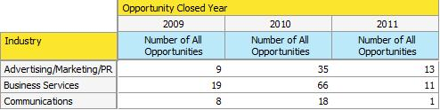

# 売上高エクスプローラでのオポチュニティの分析について{#understanding-opportunity-analysis-in-revenue-explorer}

売上高エクスプローラのオポチュニティ分析を使用すると、オポチュニティをより深いレベルで調査できます。 リードソース、業界、地域など、任意のリード/会社属性に基づいてデータをスライスし、ダイスします。 名前、ステージまたは確率に基づいて、オポチュニティの作成とクローズを分析します。 パイプラインに対するマーケティング貢献度を調べます。

## 分析の例{#example-analysis}

次に、「Opportunity」分析領域で作成できるレポートの例を示します。

1. 作成されたオポチュニティへのマーケティングの影響

   貴社のマーケティングプログラムが貴社の会社のパイプラインに与えた影響の割合は何パーセントか。 このレポートは答えを出す。 次の円グラフは、マーケティングプログラムが取得したすべてのオポチュニティの数とオポチュニティの金額の割合を示しています。

   

1. 閉じられ勝利したオポチュニティへのマーケティングの影響
1. このレポートは、売上高を獲得し、マーケティングによってどの程度影響を受けたかを、数量別に表示します。

   

1. リードソース別に終了した営業案件
1. このレポートは、リードソースによって閉じられたすべてのオポチュニティを分類し、どのソースが機能し、どのソースが機能していないかを明確に示します。

   

1. ソース別に終了する時間

   このレポートは、営業案件をクローズする平均日数とリードソースとの関係を示します。

   

1. Open OpportunityとStage

   このレポートには、各売上高サイクル段階でオープンなオポチュニティの数が表示されます。

   

1. 業種別の年別オポチュニティ数

   このレポートは、「年々特定の業界から機会が増えているか、減っているか」という質問に答えます。

   

## オポチュニティ分析のDimensionと測定{#opportunity-analysis-dimensions-and-measures}

オポチュニティ分析を使用すると、リード、会社、オポチュニティに関連するすべてのディメンションおよびオポチュニティに関連するメジャーにアクセスできます。 これらのオポチュニティ分析のディメンションとメジャーを使用して、レポート内の特定の質問に回答します。

1. 会社属性

   | Dimension | 説明 |
   |---|---|
   | 年間売上高 | 会社の年間収益 |
   | 市区町村 | 会社の所在地の市区町村 |
   | 国 | 会社の所在地の国 |
   | 業界 | 会社が属する業界 |
   | 会社名 | 会社の名前 |
   | 従業員数 | 会社内の従業員数 |
   | 郵便番号 | 会社郵便番号 |
   | SICコード | 会社のSICコード |
   | 州 | 会社が存在する状態 |

1. リード属性

   | Dimension | 説明 |
   |---|---|
   | ブロックリストに加える | 主ブロックリストに加える導者は |
   | オポチュニティに変換 | リードが営業案件に変換されます |
   | 電子メールが無効です | リードに有効な電子メールアドレスがあるかどうか |
   | マーケティングの中断 | マーケティング電子メールから中断されたリード |
   | 電子メールアドレス | リードの電子メールアドレス |
   | 肩書 | リードの肩書 |
   | フルネーム | リードのフルネーム |
   | 元のソースの種類 | リードの元のソースタイプ |
   | ソースタイプの登録 | リードの登録ソースタイプ |
   | リード所有者の電子メールアドレス | リード所有者の電子メールアドレス |
   | リード所有者の役職 | リード所有者の肩書 |
   | リードの所有者名 | リード所有者の名前 |
   | リードソース | リードソース |
   | リードのステータス | リードの状態 |

1. リードが作成した期間

   | Dimension | 説明 |
   |---|---|
   | リード作成年 | リードが作成された年 |
   | 作成された四半期のリード | リードが作成された四半期 |
   | リード作成月 | リードが作成された月 |
   | リード作成週 | リードが作成された週 |
   | リード作成日 | リードが作成された日付 |

1. オポチュニティの属性

   | Dimension | 説明 |
   |---|---|
   | 営業案件終了 | 営業案件は終了済みか |
   | 商談予測カテゴリ | 営業案件予測カテゴリ |
   | オポチュニティ名 | オポチュニティ名 |
   | オポチュニティステージ | オポチュニティステージ |
   | オポチュニティタイプ | オポチュニティタイプ |
   | オポチュニティ獲得 | この機会は閉ざされ、勝利しているか |
   | マーケティングが影響を与えたオポチュニティ | このフラグは、リード/連絡先のいずれかがマーケティングプログラムによって獲得されたか、達成されたかを示します。 期間原価が定義されているプログラムのみが考慮されます。 |

1. 営業案件終了時間枠

   | Dimension | 説明 |
   |---|---|
   | 営業案件終了年 | 営業案件が終了した年 |
   | 営業案件終了四半期 | 営業案件が終了した四半期 |
   | 営業案件終了月 | 営業案件が終了した月 |
   | 営業案件終了週 | 営業案件が終了した週 |
   | 営業案件終了日 | 営業案件が終了した日付 |

1. オポチュニティが作成した期間

   | Dimension | 説明 |
   |---|---|
   | 営業案件の作成年 | 営業案件が作成された年 |
   | 営業案件作成四半期 | 営業案件が作成された四半期 |
   | 営業案件作成月 | 営業案件が作成された月 |
   | 営業案件の作成週 | 営業案件が作成された週 |
   | 営業案件の作成日 | 営業案件が作成された日付 |

1. 測定基準

   | 測定 | 説明 |
   |---|---|
   | 営業案件を終了する平均日数 | オポチュニティを閉じる平均日数 |
   | 営業案件を終了する平均日数（損失） | 失われたオポチュニティまでの平均日数 |
   | 営業案件を終了する平均日数（勝者） | 獲得したオポチュニティまでの平均日数 |
   | すべてのオポチュニティの数 | すべてのオポチュニティの合計数 |
   | オポチュニティ数（非公開） | 終了した（勝った、または失われた）オポチュニティの合計数 |
   | オポチュニティの数（損失） | 失われたオポチュニティの合計数 |
   | オポチュニティ数（オープン） | まだ開いているオポチュニティの合計数 |
   | オポチュニティの数（獲得） | 獲得したオポチュニティの合計数 |
   | 営業案件金額 | 営業案件の合計金額です。 2つ以上のリードが商談に関連付けられている場合、配分金額はリードスコアに基づきます。 |
   | 営業案件金額（損失） | 失われたオポチュニティの合計金額。 2つ以上のリードが商談に関連付けられている場合、配分金額はリードスコアに基づきます。 |
   | 商談金額（オープン） | オープンオポチュニティの合計金額。 2つ以上のリードが商談に関連付けられている場合、配分金額はリードスコアに基づきます。 |
   | 営業案件金額（ウォン） | 獲得したオポチュニティの合計金額。 2つ以上のリードが商談に関連付けられている場合、配分金額はリードスコアに基づきます。 |

>[!MORELIKETHIS]
>
>* [売上高エクスプローラレポートの作成](create-a-revenue-explorer-report.md)
>* [売上高エクスプローラレポートへのフィールドの追加](adding-fields-to-a-revenue-explorer-report.md)
>* [売上高エクスプローラレポートの購読](subscribe-to-a-revenue-explorer-report.md)

>

