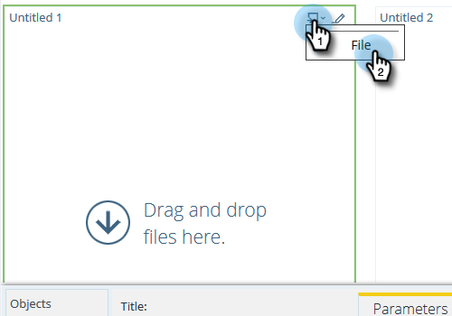

# 売上高エクスプローラーでのダッシュボードの使用 {#using-dashboards-in-revenue-explorer}

ダッシュボードは、売上高エクスプローラーレポートを組み合わせたもので、リード、キャンペーン、商談、モデルの概要を素早く把握できます。

## ダッシュボードの新規作成 {#creating-a-new-dashboard}

1. 「**売上高エクスプローラー**」をクリックします。

   

1. 「**新規作成**」をクリックし、「**ダッシュボード**」をクリックします。

   

1. ページの下部では、デフォルトで「テンプレート」が選択されます。使用するレイアウトをクリックします。ここでは、「2 列」を使用します。

   

   >[!NOTE]
   >
   >「**テーマ**」をクリックし、好きなテーマを選択することで、ダッシュボードの外観をさらにカスタマイズできます。

1. ダッシュボードの最初のセクションで、**挿入**&#x200B;アイコンをクリックし、「**ファイル**」を選択します。

   

1. 「**売上高エクスプローラー**」をダブルクリックします。

   

1. 「**すべてのレポートとダッシュボード**」をダブルクリックします。

   

1. 使用するレポートを含むフォルダーをダブルクリックします。

   

1. レポートを選択し、「**選択**」をクリックします。

   

1. レポートが表示されます。残りのセクションについても、手順 4～8 を繰り返します。

   

1. セクション名を変更するには、セクションをクリックして選択し、「タイトル」に目的の名前を入力して、「**適用**」をクリックします。各セクションに対して繰り返します。

   

1. 保存するには、「保存」アイコンをクリックし、ファイル名を入力し、売上高エクスプローラーフォルダーをダブルクリックして、ダッシュボード用の目的のフォルダーに移動し、「**保存**」をクリックします。

   

## ダッシュボードの編集 {#editing-a-dashboard}

1. 「**売上高エクスプローラー**」をクリックします。

   

1. 「**売上高エクスプローラー**」フォルダーをダブルクリックします。ダッシュボードの場所に移動します。

   

1. 編集するダッシュボードを選択し、「**編集**」をクリックします。

   

## ダッシュボードの削除 {#deleting-a-dashboard}

1. 「**売上高エクスプローラー**」をクリックします。

   

1. 「**売上高エクスプローラー**」フォルダーをダブルクリックします。ダッシュボードの場所に移動します。

   

1. 削除するダッシュボードを選択し、「**ごみ箱に移動**」をクリックします。

   
