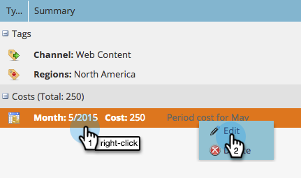
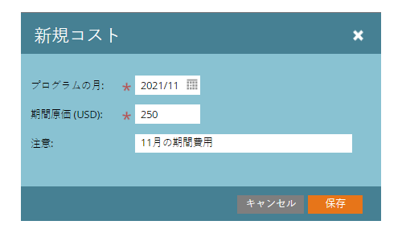

# 期間原価の定義 {#define-period-costs}

>[!NOTE]
>
>**定義**
>
>期間原価は、プログラムに費やした金額です。月額の場合も複数月にわたる費用の場合もあり、ROI のレポートに使用されます。

リードのコストを取るタイミングと場所を定義することで、プログラムまたはイベントのリード育成とリード獲得のコストを追跡し、関連付けます。

>[!NOTE]
>
>プログラムの最初に、予測コストを入力します。プログラムの期間が完了したら、「期間原価」を編集し、実際の原価を入力できます。これにより、正確なレポート結果が得られます。

## 期間原価の定義 {#define-a-period-cost}

1. プログラムまたはイベントの「**設定**」タブに移動します。

   

1. **期間原価**&#x200B;をキャンバスにドラッグ＆ドロップすると、**新規コスト**&#x200B;ダイアログボックスが表示されます。

   

1. 定義したコストに関連付ける&#x200B;**プログラムの月**&#x200B;を入力します。

   

1. **期間原価**&#x200B;を小数またはコンマを含まない整数として入力します（最大値：99999999)。

   

   >[!NOTE]
   >
   >通貨（USD、EUR など）は、Marketo 管理者が管理するグローバル設定です

1. （オプション）説明的な&#x200B;**メモ**&#x200B;を入力して、「**保存**」をクリックします。

   

## 期間原価の編集 {#edit-a-period-cost}

1. 期間原価を右クリックし、ポップアップメニューから「**編集****」を選択すると、コストを編集**&#x200B;ダイアログボックスが開きます。

   

1. 必要に応じて期間原価を編集

   

## 期間原価の削除 {#delete-a-period-cost}

1. 削除する期間原価を右クリックし、ポップアップメニューから「**削除**」を選択すると、**コストを削除**&#x200B;プロンプトが表示されます。

   

1. 「**削除**」をクリックして期間原価を完全に削除する、または「**キャンセル**」をクリックして戻ります。

   
