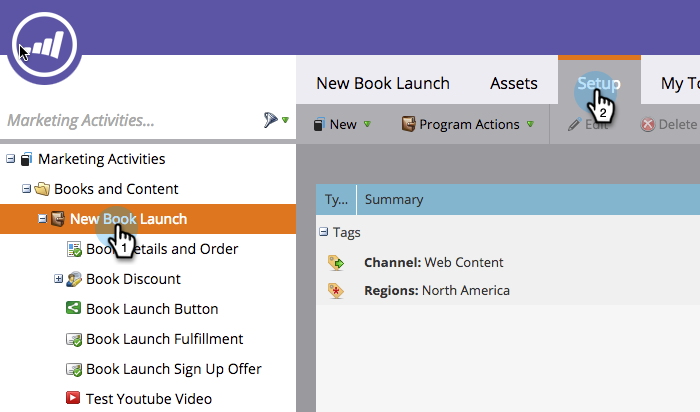
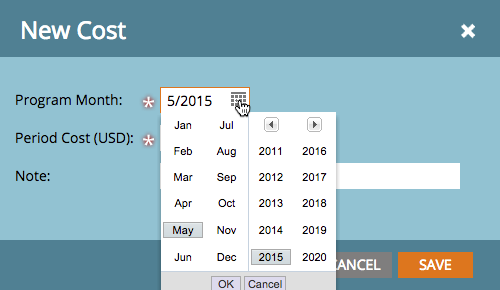
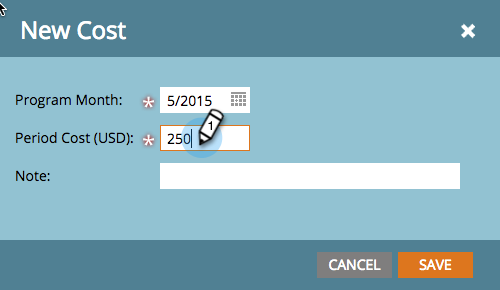
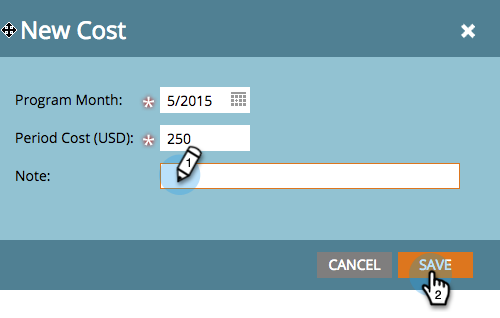
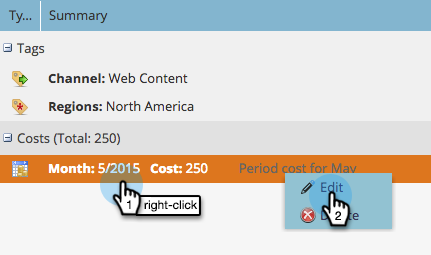
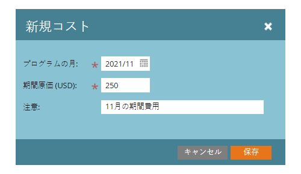
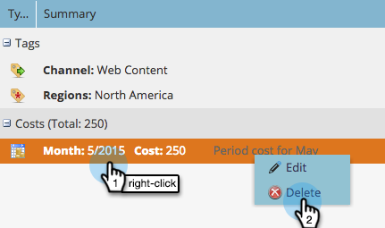
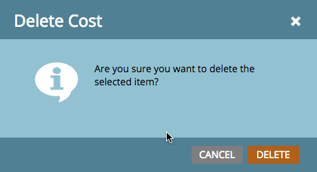

# 期間原価の定義 {#define-period-costs}

>[!NOTE]
>
>**定義**
>
>期間コストは、プログラムに費やした金額です。 月額の場合も複数月にわたる費用の場合もあり、ROI のレポートに使用されます。

リードのコストを取るタイミングと場所を定義することで、プログラムまたはイベントのリード育成とリード獲得のコストを追跡し、関連付けます。

>[!NOTE]
>
>プログラムの最初に、予測コストを入力します。 プログラムの期間が完了したら、「[!UICONTROL 期間原価]」を編集し、実際のコストを入力できます。 これにより、正確なレポート結果が得られます。

## [!UICONTROL 期間原価]の定義 {#define-a-period-cost}

1. プログラムまたはイベントの「**[!UICONTROL 設定]**」タブに移動します。

   

1. **[!UICONTROL 期間原価]**&#x200B;をキャンバスにドラッグ＆ドロップすると、**[!UICONTROL 新規コスト]**&#x200B;ダイアログボックスが表示されます。

   

1. 定義したコストに関連付ける&#x200B;**[!UICONTROL プログラムの月]**&#x200B;を入力します。

   

1. **[!UICONTROL 期間原価]**&#x200B;を小数またはコンマを含まない整数として入力します（最大値：99999999)。

   

   >[!NOTE]
   >
   >通貨（USD、EURなど） は、Marketo管理者が管理するグローバル設定です

1. （オプション）説明的な&#x200B;**[!UICONTROL メモ]**&#x200B;を入力して、「**[!UICONTROL 保存]**」をクリックします。

   

## [!UICONTROL 期間原価]の編集 {#edit-a-period-cost}

1. [!UICONTROL 期間原価]を右クリックし、ポップアップメニューから「**[!UICONTROL 編集]**」を選択すると、**[!UICONTROL コストを編集]**&#x200B;ダイアログボックスが開きます。

   

1. 必要に応じて期間コストを編集します。

   

## [!UICONTROL 期間原価]の削除 {#delete-a-period-cost}

1. 削除する[!UICONTROL 期間原価]を右クリックし、ポップアップメニューから「**[!UICONTROL 削除]**」を選択すると、**[!UICONTROL コストを削除]**&#x200B;プロンプトが表示されます。

   

1. 「**[!UICONTROL 削除]**」をクリックして期間原価を完全に削除する、または「**[!UICONTROL キャンセル]**」をクリックして戻ります。

   
