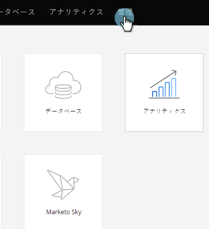

# 売上サイクル分析用のカスタムフィールドの同期を有効にする{#enabling-custom-field-sync-for-revenue-cycle-analytics}

次の手順では、RCAレポートでカスタムフィールドを使用できます。

1. 「**管理者**」をクリックします。

   

1. 「**売上高サイクル分析**」をクリックし、「**カスタムフィールドの同期**」をクリックします。

   

1. **フィールド名**&#x200B;を選択し、「**同期オプションを編集**」をクリックします。

   

1. 「同期ステータス」で、「**有効**」を選択し、「**保存**」をクリックします。

   

1. 緑のチェックマークを付けると、フィールドが同期するように設定されていることが通知されます。

   

   それだ！

   >[!NOTE]
   >
   >フィールドを有効にすると、そのデータは翌日にRevenue Cycle Analyticsで利用できるようになります。

