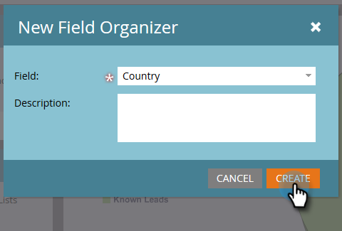
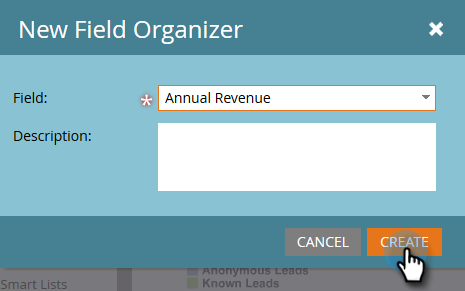

# フィールドオーガナイザーを使用したカスタムフィールドグループの作成 {#create-custom-field-groups-using-the-field-organizer}

売上高サイクルエクスプローラのモデルパフォーマンス分析（リード）エリアでレポート用のカスタムフィールドグループを有効にする前に、Marketo リード管理のフィールドオーガナイザーで、レポート用に標準フィールドまたはカスタムフィールドをグループに分類する必要があります。これは、リード属性と会社属性にのみ適用されます。「新規フィールドオーガナイザー」ダイアログボックスの「フィールド」ドロップダウンから標準フィールドまたはカスタムフィールドを選択すると、グループ化するフィールドに関連付けて、Marketo リード管理のデータタイプが、フィールドオーガナイザーで利用可能な 3 つのエディター（文字列、整数、日付）のいずれかにマッピングされます。

| Marketo リード管理データタイプ | フィールドオーガナイザーエディターのデータタイプ |
|---|---|
| 文字列 | 文字列 |
| メール | 文字列 |
| 整数 | 整数 |
| テキスト | 文字列 |
| URL | 文字列 |
| 参照 | サポート対象外 |
| 通貨 | 整数 |
| 日時 | 日付 |
| ブール値 | サポート対象外 |
| 電話 | 文字列 |
| 日付 | 日付 |
| 浮動 | 整数 |
| 計算 | サポート対象外 |

次の 3 つの節では、文字列、整数または日付タイプのカスタムフィールドグループを作成する方法について説明します。

## カスタムフィールドグループの作成 - 文字列エディター {#create-custom-field-group-string-editor}

1. 「**リードデータベース**」をクリックします。

   

1. 「**新規**」をクリックし、「**新規フィールドオーガナイザー**」を選択します。

   

1. 「**フィールド**」をクリックし、文字列エディターにマッピングされる標準フィールドまたはカスタムフィールドを選択します（前の節の表を参照）。この例では、「国」を選んでいます。

   

1. 「**作成**」をクリックします。

   

   新しいカスタムグループが、フィールド名／フィールド名グループのように、リードデータベースツリーに表示されます（例：国／国グループ）。

   

1. 鉛筆アイコンをクリックして名前をカスタマイズします。例えば、「国グループ」を「大陸」に変更できます。任意の新しい名前を入力し、ボックスの外をクリックすると、自動的に保存されます。

   

1. デフォルトでは、データ値はすべて「その他」サブグループに配置されます。データ値を分類するには、「**グループを追加**」をクリックしてサブグループを作成し、名前を付けます。

   >[!NOTE]
   >
   >最大 10 個のサブグループを追加して、データ値を分類できます。作成した各サブグループには、ID 番号が割り当てられます。

   この例では、大部分の大陸に対してグループが作成されています。

   

   >[!NOTE]
   >
   >サブグループを削除するには、サブグループ名の横にある赤い「X」をクリックします。グループ内にデータ値がある場合、そのデータ値は「その他」のデフォルトのグループに移動されます。

1. キャンバスでデータ値をハイライト表示し、適切なサブグループにデータ値をドラッグ&amp;ドロップします。

   

   >[!NOTE]
   >
   >サブグループからデータ値を削除するには、データ値をデフォルトのグループ「その他」に割り当てます。

1. キャンバスの右上隅にあるフィルターオプションを使用して、1 つ以上のサブグループのデータ値を選択して表示します。フィルターの選択に基づくデータ値がキャンバスに表示されます。

   

   >[!NOTE]
   >
   >グループを定義すると、Marketo 管理グループの「売上高サイクル分析」タブから「モデル効果分析（リード）］でレポートを作成するとき、カスタムフィールドグループを有効にできます。

## カスタムフィールドグループの作成 - 整数エディター {#create-custom-field-group-integer-editor}

1. 「**リードデータベース**」をクリックします。

   

1. 「**新規**」をクリックし、「**新規フィールドオーガナイザー**」を選択します。

   

1. 「**フィールド**」をクリックし、文字列エディターにマッピングされる標準フィールドまたはカスタムフィールドを選択します（前の節の表を参照）。ここでは年間売上高が使用されます。

   

1. 「**作成**」をクリックします。

   

   新しいカスタムグループが、フィールド名／フィールド名グループのように、リードデータベースツリーに表示されます（例：年間売上高／年間売上高グループ)。

   

1. 整数エディターの上にあるデフォルトのカスタムグループ名をクリックして、名前をカスタマイズします。例えば、「年間売上高グループ」を「規模別年間売上高」に変更できます。「**保存**」をクリックします。

   

   整数エディターを使用すると、複数のサブグループを作成して、各サブグループをサイズ別に定義できます。この例では、小規模法人、中規模法人、大規模法人の 3 つのグループが作成されます。

1. 最初のグループを追加するには、「**グループ名**」フィールドに名前（例：「小規模法人」）を入力し、「**グループ範囲**」フィールドに最大値を入力します（例：200000）。「**グループを追加**」をクリックします。

   

   空のグループエントリが、入力したグループのすぐ下に表示されます。以下の例では、「小規模法人」、「中規模法人」、「大規模法人」の企業規模別エントリが表示されています。

   >[!NOTE]
   >
   >最大 10 個のサブグループを追加して、データ値を分類できます。各グループ範囲エントリは、前のエントリに基づいて作成されます。最後に作成したカスタムサブグループのグループ範囲エントリを空白のままにした場合、最大データ値は設定されません。

1. 「概要」タブをクリックし、設定を保存して確認します。

   

   >[!NOTE]
   >
   >サブグループを削除するには、サブグループ名の隣にある赤い「X」をクリックします。

1. 概要ページで、設定を確認します。

   

   >[!NOTE]
   >
   >グループを定義すると、Marketo 管理グループの「売上高サイクル分析」タブから「モデル効果分析（リード）］でレポートを作成するとき、カスタムフィールドグループを有効にできます。

## カスタムフィールドグループの作成 - 日付エディター {#create-custom-field-group-date-editor}

1. 「**リードデータベース**」をクリックします。

   

1. 「**新規**」をクリックし、「**新規フィールドオーガナイザー**」を選択します。

   

1. 「**フィールド**」をクリックし、文字列エディターにマッピングされる標準フィールドまたはカスタムフィールドを選択します（前の節の表を参照）。ここでは獲得日を使用します。

   

1. 「**作成**」をクリックします。

   

   新しいカスタムグループが、フィールド名／フィールド名グループのように、リードデータベースツリーに表示されます（例：獲得日／獲得日グループ）。

   

1. 日付エディターの上にあるデフォルトのカスタムグループ名をクリックして、名前をカスタマイズします。例えば、「獲得日グループ」を「獲得日カテゴリ」に変更できます。「**保存**」をクリックします。

   

   日付エディターでは、複数のサブグループを作成して、各グループを日付別に定義することができます。この例では、「2015 年 Q1 のリード」、「2015 年 Q2 のリード」、「2015 年 Q3 のリード」の 3 つのグループが作成されます。

1. 最初のグループを追加するには、「**グループ名**」フィールドに名前（例：「2015 年 Q1 のリード」）を入力し、リードが獲得された日付、またはそれ以前の日付（例：2015 年 Q1 の最終日を表す 2015/3/31）を日付フィールドに入力します。「**グループを追加**」をクリックします。

   

   >[!NOTE]
   >
   >最大 10 個のサブグループを追加して、データ値を分類できます。各グループ範囲エントリは、前のエントリに基づいて作成されます。最後に作成したカスタムサブグループのグループ範囲エントリを空白のままにした場合、終了日の値は設定されません。

   以下の例では、2015 年第 1 四半期から第 3 四半期までのエントリを示しています。

   

   これで完了です。お疲れさまでした。
