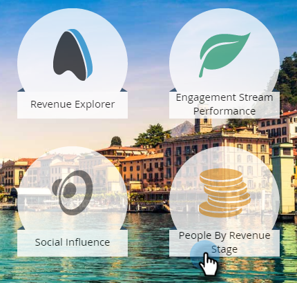
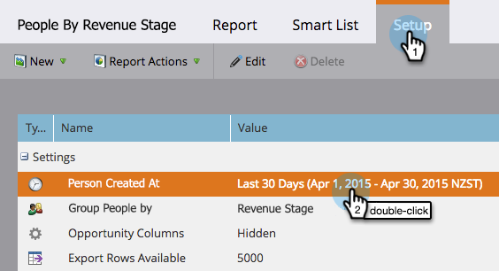
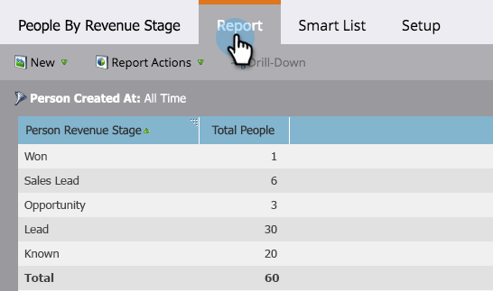

# 収益ステージ別のリードレポート {#people-by-revenue-stage-report}

リードが属する収益サイクルモデルのステージを示すレポートを作成できます。 レポートの特定の日付範囲に対する個人の残高がある限り、レポートには、指定したモデルの任意のステージが含まれます。

>[!AVAILABILITY]
>
>この機能は一部の Marketo エディションに含まれています。 詳細は担当営業にお問い合わせください。

1. **[!UICONTROL 分析]**&#x200B;に移動します。

   

1. **[!UICONTROL リード - 収益ステージ別]**&#x200B;レポートをクリックします。

   

1. 「**[!UICONTROL 設定]**」タブをクリックします。 「**[!UICONTROL リード作成時刻]**」フィールドをダブルクリックして、レポートする時間枠を入力します。

   

1. 時間枠を編集し、「**[!UICONTROL 保存]**」をクリックします。

   

1. 「**[!UICONTROL レポート]**」タブをクリックします。 これで、リードが収益モデルのどのステージにいるかを確認し、ボトルネックに焦点を当てることができます。

   
