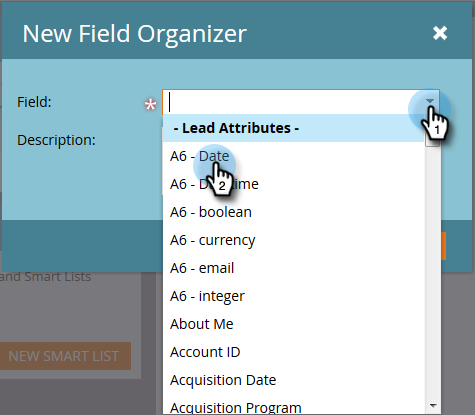
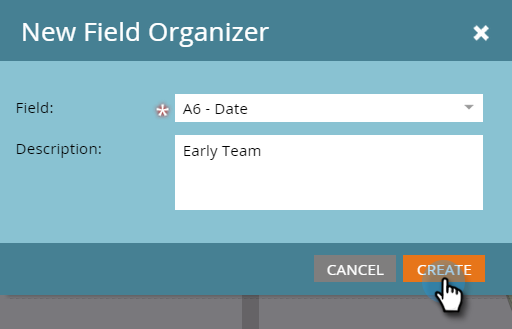
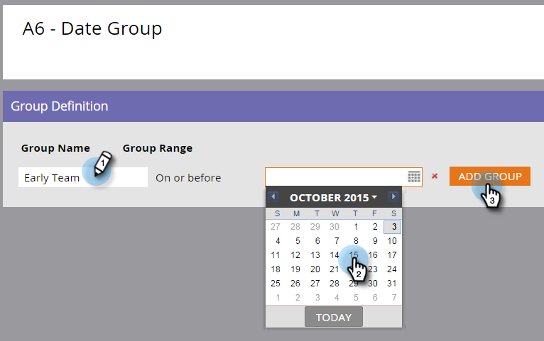

# フィールドオーガナイザーの使用{#using-field-organizers}

フィールド主催者は、すべての可能な値の中から特定のフィールドを指定するのに役立ちます。 例えば、Territoryフィールドに、西海岸や東海岸などの意味のあるグループを作成できます。 これにより、レポートの実行が速くなります。

フィールドオーガナイザーはセグメント化に似ていますが、一般的に使用されますが、フィールドオーガナイザーはフィールドレベルでのレポートに使用されます。

1つのフィールドリストに最大3つのカスタムセグメントを含めることができます。

特定のフィールドオーガナイザーレポートはありません。

フィールドオーガナイザーは、モデルパフォーマンス分析で使用されます。

## フィールド主催者の作成方法{#how-to-create-field-organizers}

1. 「**Database**」をクリックします。

   

1. 「**新しい**」で、「**新しいフィールドオーガナイザー**」を選択します。

   

1. 「**フィールド**」で、属性を選択します。 説明はオプションです。

   

1. 「**作成**」をクリックします。

   

1. グループに名前を付け、適切なデータを入力します（これは、選択したフィールドのデータタイプによって異なります）。 「**追加グループ**」をクリックします。

   

必要に応じて、同じ方法でフィールドオーガナイザーを追加します。 そして、あなたはそこにいます。

>[!MORELIKETHIS]
>
>[フィールドオーガナイザーを使用したカスタムフィールドグループの作成](/help/marketo/product-docs/reporting/revenue-cycle-analytics/revenue-tools/field-organizers/create-custom-field-groups-using-the-field-organizer.md)
