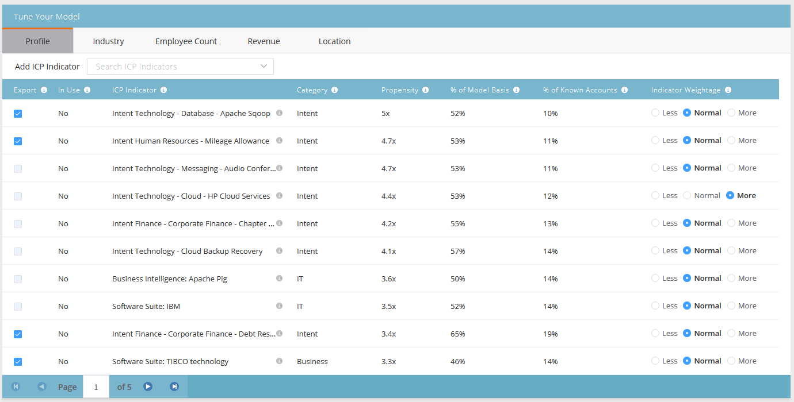

# アカウントのプロファイリングのランキングと調整 {#account-profiling-ranking-and-tuning}

アカウントプロファイリングは、理想的な顧客プロファイル（ICP）を特定し、ICP に基づきデータベース内の企業をランク付けし、ICP 指標データを重点顧客として昇格されたアカウントに追加します。

## モデル結果 {#model-results}

成績別に分類された既知のアカウントがすべて表示されます。A は最も高いグレード、D は最も低いグレードです。

オプションではありますが、「自動的に昇格」チェックボックスはオンにすることをお勧めします。これにより、時間を大幅に節約できます。ただし、各アカウントを調べて[手動で追加する](/help/marketo/product-docs/target-account-management/target/named-accounts/discover-accounts.md#discover-crm-accounts)場合は、このチェックボックスをオフのままにしておきます。

<table> 
 <tbody> 
  <tr> 
   <td><strong>ランク</strong></td> 
   <td> 
    

      理想的な顧客プロファイルに基づくアカウントランク。A は最適で、D は最も適していません。 
    
</td> 
  </tr> 
  <tr> 
   <td><strong>傾向</strong></td> 
   <td> 
    

      非 ICP に基づいて選択したアカウントと比較した、コンバージョン率の推定増加。 
    
</td> 
  </tr> 
  <tr> 
   <td><strong>アカウント（%）</strong></td> 
   <td> 
    

      このランクを持つモデル入力のアカウントの割合。 
    
</td> 
  </tr> 
  <tr> 
   <td><strong>モデル基準の割合</strong></td> 
   <td> 
    

      このランクを持つモデル基準のアカウントの割合。 
    
</td> 
  </tr> 
 </tbody> 
</table>

## モデルの調整 {#model-tuning}

「モデル」タブで、「モデルを調整」ボタンをクリックします。

いくつかのタブから選択でき、詳細なカスタマイズが可能です。

**指標カテゴリ**

<table> 
 <tbody> 
  <tr> 
   <td><strong>コンプライアンス</strong></td> 
   <td> 
    

      認定、コンプライアンス関連の職階／雇用。 
    
</td> 
  </tr> 
  <tr> 
   <td><strong>運用</strong></td> 
   <td> 
    

      業務関連の職階／雇用。 
    
</td> 
  </tr> 
  <tr> 
   <td><strong>人事</strong></td> 
   <td> 
    

      人事または給与計算ソフトウェア、人事関連の職階／雇用。
    
</td> 
  </tr> 
  <tr> 
   <td><strong>エンジニアリング</strong></td> 
   <td> 
    

      テクノロジー、フレームワーク、エンジニアリング関連の職階／雇用。 
    
</td> 
  </tr> 
  <tr> 
   <td><strong>セールス</strong></td> 
   <td> 
    

      セールス向けソリューションとソフトウェア、セールス関連の職階／雇用。 
    
</td> 
  </tr> 
  <tr> 
   <td><strong>目的</strong></td> 
   <td> 
    

      目的指標。 
    
</td> 
  </tr> 
  <tr> 
   <td><strong>IT</strong></td> 
   <td> 
    

      ハードウェアおよびソフトウェアのソリューション、テクノロジー、IT 関連の職階／雇用。
    
</td> 
  </tr> 
  <tr> 
   <td><strong>財務</strong></td> 
   <td> 
    

      財務ソフトウェア、財務関連の職階／雇用。 
    
</td> 
  </tr> 
  <tr> 
   <td><strong>マーケティング</strong></td> 
   <td> 
    

      マーケティング技術およびソフトウェア、マーケティング関連の職階／雇用。 
    
</td> 
  </tr> 
  <tr> 
   <td><strong>ビジネス</strong></td> 
   <td> 
    

      Forbes リストや上場企業またはビジネスパートナーシップ。 
    
</td> 
  </tr> 
  <tr> 
   <td><strong>カスタマーエクスペリエンスとリレーション</strong></td> 
   <td> 
    

      カスタマーサクセスおよびカスタマーリレーション関連の職階／雇用。
    
</td> 
  </tr> 
 </tbody> 
</table>

各列の説明を表示するには、ツールヒントの上にカーソルを置きます。

「ICP 指標の追加」ドロップダウンをクリックして、モデルに追加の指標を挿入します。

「エクスポート」チェックボックスをオンにすると、重点顧客の詳細ページで ICP 指標を表示でき、選択した ICP 指標を[重点顧客フィルター](/help/marketo/product-docs/target-account-management/engage/account-filters.md)の制約として使用できます。

>[!NOTE]
>
>ICP 指標は、**重点顧客のメンバー**&#x200B;フィルターとトリガーに制約として含まれます。

指標の重み付けは、モデル内で各指標が受け取る重要度のレベルを制御します。

変更を有効にするには、「モデルを更新」をクリックします。

（更新後に）モデルの調整が完了したら、「モデル結果」タブに戻り、「**保存してランクを適用**」をクリックします。

