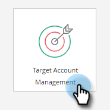
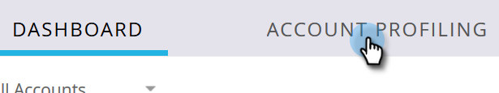
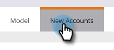
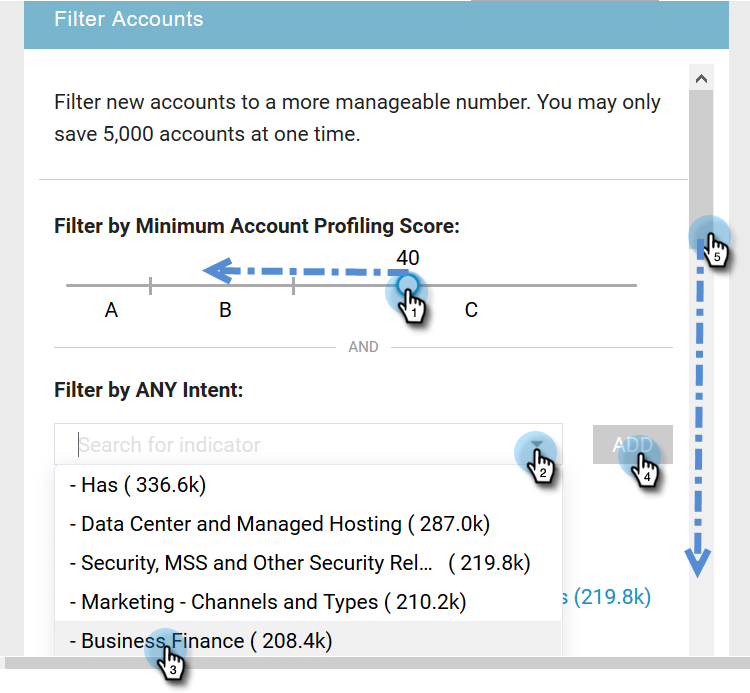
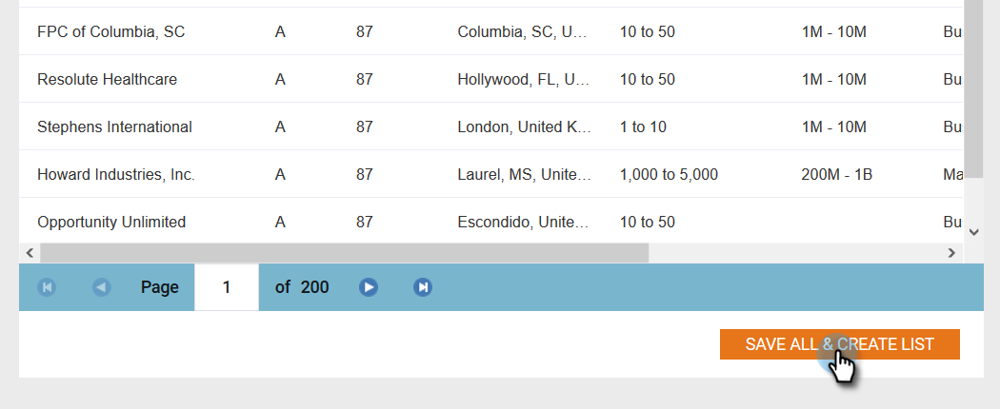
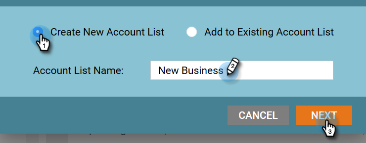
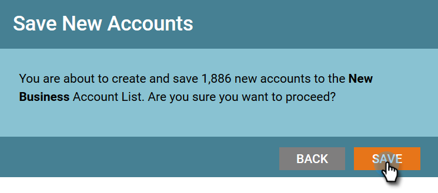
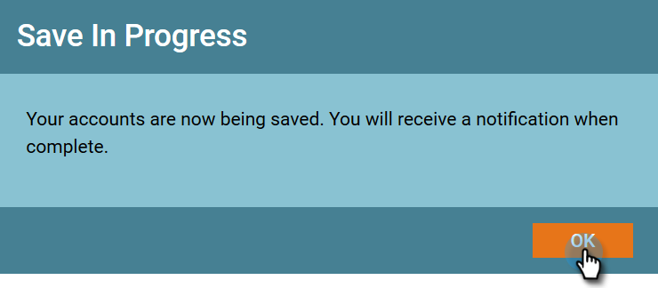

# 新しい顧客の検出 {#new-account-discovery}

新しいアカウントの検出を使用すると、理想的な顧客プロファイルに基づく AI を活用したレコメンデーションにより、ターゲットとする新しいアカウントを見つけることができます。

>[!IMPORTANT]
>
>2025 年をもって、新規ユーザはアカウントプロファイリングを使用できなくなります。 既存のユーザに対しては引き続き機能します。

>[!PREREQUISITES]
>
>[顧客プロファイルの設定](/help/marketo/product-docs/target-account-management/account-profiling/setting-up-account-profiling.md)

>[!TIP]
>
>新しいアカウント検索を実行する前に、**既存アカウントの更新** ボタンを押して、最新のデータを確認することをお勧めします。 この更新には、最大 24 時間かかる場合があります。

1. My Marketo で、「**[!UICONTROL ターゲット顧客管理]**」をクリックします。

   

1. 「**[!UICONTROL 顧客プロファイリング]**」タブをクリックします。

   

1. 「**[!UICONTROL 新規顧客]**」タブをクリックします。

   

   >[!NOTE]
   >
   >「[!UICONTROL 新規アカウント]」には、TAM に含まれていないアカウントのリストが表示されます。 これらは、選択したフィルターに基づいて、自社にとって新規となる可能性のあるアカウントです。

1. 適用可能なすべてのフィルターを選択します（この部分は高度にカスタマイズ可能です。以下は、フィルタリングを示す一例に過ぎません）。

   

1. ページの右下にある「**[!UICONTROL すべて保存してリストを作成]**」をクリックします。

   

   >[!NOTE]
   >
   >必要な顧客が少数のみ表示された場合は、個々の顧客をクリックして、完了したら「**選択した顧客を保存**」をクリックします。

1. リストを新しいアカウントリストとして作成することも、既存のアカウントリストに追加することもできます。 この例では、新しく作成します。

   

   >[!NOTE]
   >
   >既存の顧客リストに保存するには、そのオプションを選択し、ドロップダウンをクリックして目的の顧客リストを選択し、「**[!UICONTROL 次へ]**」をクリックします。

1. 「**[!UICONTROL 保存]**」をクリックします。

   

   >[!NOTE]
   >
   >一度に保存できるアカウントは 5,000 件までです。 検索結果が 10,000 件あった場合、最初の（上位）5,000 件を保存し、次にフィルターをリセットして、次の 5,000 件を保存する必要があります。 **合計**&#x200B;顧客の上限は 100 万です。

1. 「**[!UICONTROL OK]**」をクリックします。

   

   >[!TIP]
   >
   >アカウントを保存した後、[&#x200B; [!DNL LinkedIn]](/help/marketo/product-docs/target-account-management/target/create-an-account-matched-audience-on-linkedin.md) で一致したオーディエンスを使用してターゲティングできます。
