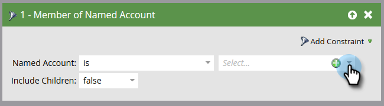

# アカウントフィルター{#account-filters}

新しいアカウント中心のフィルターを使用して、固有のアカウントとその中の個人を特定し、関与させます。

## TAMフィルター{#tam-filters}

1. スマートキャンペーンを選択し、**スマートリスト**&#x200B;をクリックします。

   

1. **+**&#x200B;をクリックして&#x200B;**アカウントフィルター**&#x200B;フォルダーを展開します。

   

1. 使用するフィルターをキャンバスにドラッグします。

   

## アカウントリストのメンバ{#member-of-account-list}

このフィルタを使用するには、アカウントリストドロップダウンをクリックします。

...目的のアカウントリストを選択します。

>[!NOTE]
>
>アカウントリストのメンバーフィルターには、次の修飾子が1つだけあります。&quot;is&quot; — 追加の修飾子（「is not」や「is any」など）は使用できません。

## 名前付きアカウントのメンバ{#member-of-named-account}

まず、修飾子を選択します。 **特定の名前のアカウントに** 対しては **、または任意の名前のアカウント** に対しては何でも発生します。

[名前付きアカウント]ドロップダウンリストをクリックします。

...をクリックし、目的の名前付きアカウントを選択します。

「いずれか」の修飾子を使用する場合は、[制約](/help/marketo/product-docs/core-marketo-concepts/smart-lists-and-static-lists/using-smart-lists/add-a-constraint-to-a-smart-list-filter.md)を利用して検索結果を絞り込むことができます。 好き追加なだけ！

単一の最上位アカウントからのメンバーのみを必要とする場合は、「子を含める」をfalseに設定します。 すべての子アカウントからメンバーを作成する場合は、trueを選択します。

>[!MORELIKETHIS]
>
>[アカウントトリガー](/help/marketo/product-docs/target-account-management/engage/account-triggers.md)
