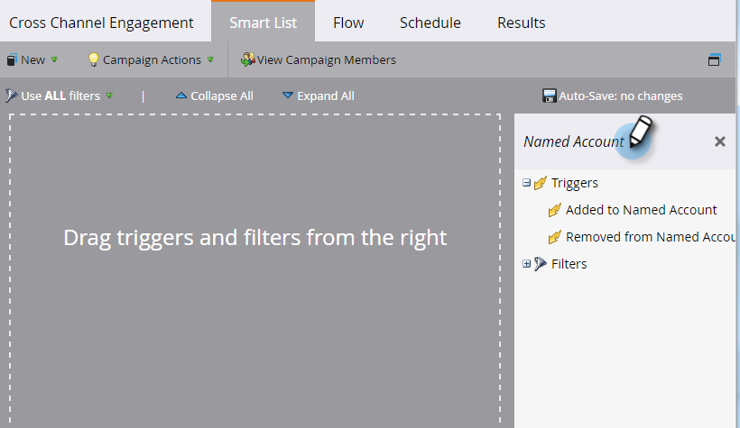

# アカウントトリガー {#account-triggers}

アカウントレベルのトリガーを使用して、様々なチャネル（メール、web、広告など）をまたいだ、アカウントレベルの重要な行動的なアクティビティをリッスンし、それに基づいてアクションを取ります。

目的のスマートキャンペーンに移動して「**[!UICONTROL スマートリスト]**」をクリックします。

検索ボックスに「重点顧客」と入力して、重点顧客トリガーを検索します。

目的のトリガーをキャンバスにドラッグします。この例では、_重点顧客に追加済み_&#x200B;を使用します。

修飾子を選択します。

重点顧客ドロップダウンをクリックして、

目的の重点顧客を選択します。

これで完了です。残りのスマートキャンペーンを終了したら、忘れずにそのキャンペーンを有効にしてください。

>[!MORELIKETHIS]
>
>[アカウントフィルター](/help/marketo/product-docs/target-account-management/engage/account-filters.md)
