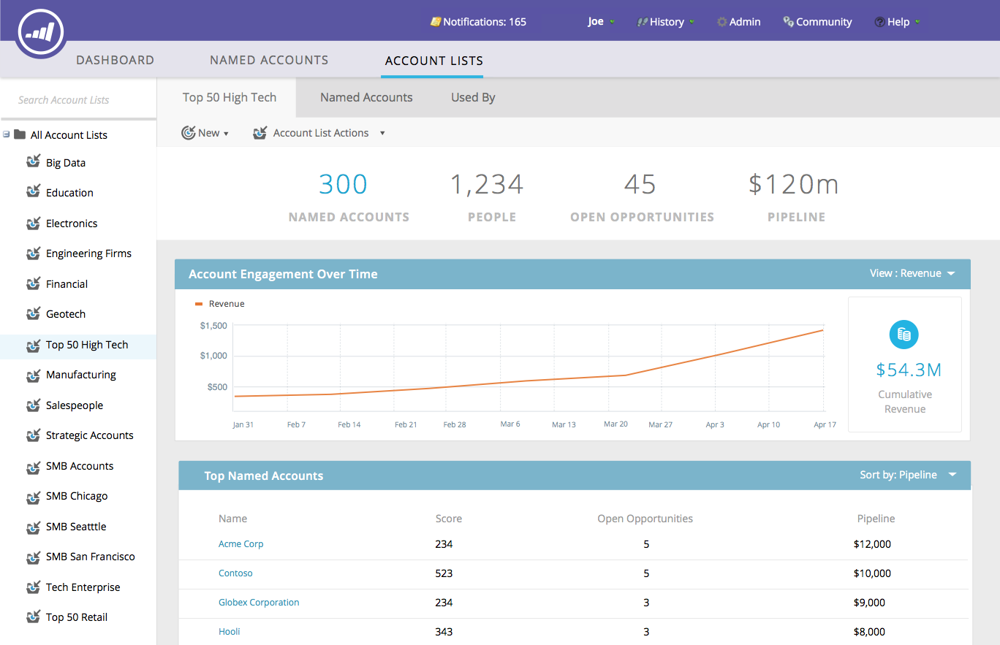

# 顧客リストインサイト {#account-list-insights}

顧客リストダッシュボードには、リスト内のすべての重点顧客から集計したインサイトのビューが表示されます。

>[!NOTE]
>
>Marketo TAM は、生成されたパイプラインまたは顧客エンゲージメントスコアに基づいて、顧客リスト内の上位の重点顧客を自動的に決定します。

## 顧客リストダッシュボード {#account-list-dashboard}

顧客リストダッシュボードを表示するには、その名前をクリックします。

...ダッシュボードが表示されます。

<table>
 <tbody>
  <tr>
   <td colspan="1"><strong>パイプライン</strong></td>
   <td colspan="1">経時的なパイプラインを表示します。 週ごとの経時的なパイプラインを判断するため、最終日にパイプラインを取得します。</td>
  </tr>
  <tr>
   <td><strong>売上高</strong></td>
   <td>
経時的な売上高を表示します。 週ごとの経時的な売上高を判断するため、その週の全売上高の合計を取り込みます。
</td>
  </tr>
 </tbody>
</table>

## 重点顧客タブ {#named-accounts-tab}

「**[!UICONTROL 重点顧客]**」タブをクリックして、該当する顧客リストに属する重点顧客を確認します。

>[!NOTE]
>
>このタブで重点顧客を選択して「**[!UICONTROL 重点顧客を削除]**」をクリックして、重点顧客を削除することができます。

## [!UICONTROL 使用者]タブ {#used-by-tab}

「**[!UICONTROL 使用者]**」タブをクリックして、どのアセットがそのアカウントリストを参照しているかを確認します。

