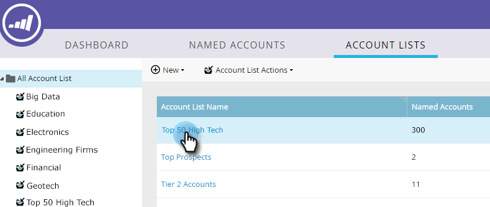
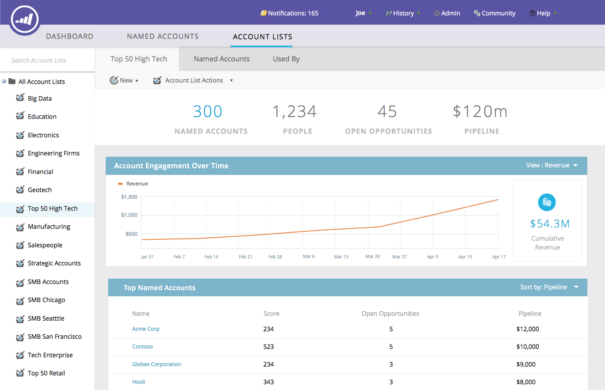
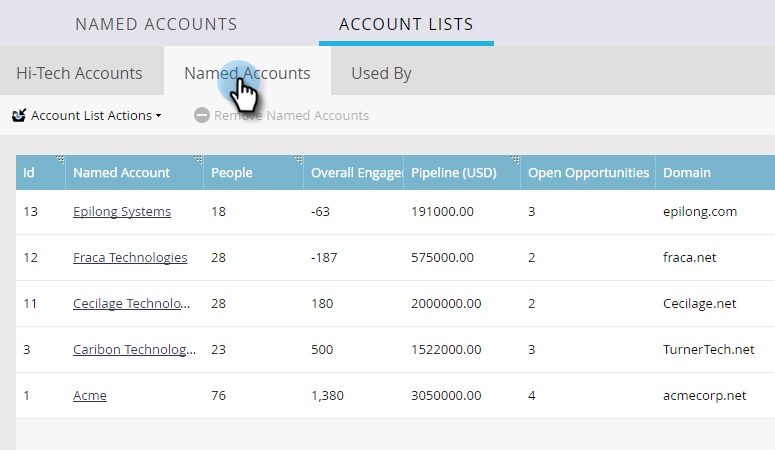
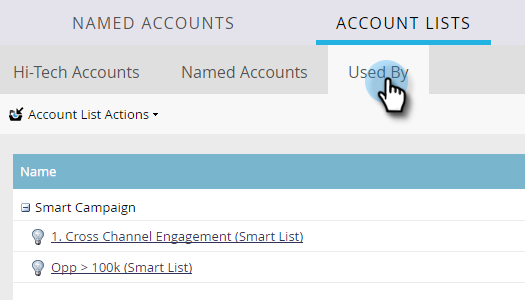

# 顧客リストインサイト {#account-list-insights}

アカウントリストダッシュボードには、リスト内のすべての重点アカウントから集計したインサイトのビューが表示されます。

>[!NOTE]
>
>Marketo TAM は、生成されたパイプラインまたはアカウントエンゲージメントスコアに基づいて、アカウントリスト内の上位の重点アカウントを自動的に判定します。

## 顧客リストダッシュボード {#account-list-dashboard}

アカウントリストのダッシュボードを表示するには、その名前をクリックします。

...ダッシュボードが表示されます。

<table>
 <tbody>
  <tr>
   <td colspan="1"><strong>パイプライン</strong></td>
   <td colspan="1">経時的なパイプラインを表示します。 週ごとの経時的なパイプラインを算出するため、各週の最終日のパイプラインの値を使用します。</td>
  </tr>
  <tr>
   <td><strong>売上高</strong></td>
   <td>
経時的な売上高を表示します。 週ごとの経時的な売上高を算出するため、その週に獲得した売上高の合計を使用します。
</td>
  </tr>
 </tbody>
</table>

## 重点顧客タブ {#named-accounts-tab}

「**[!UICONTROL 重点顧客]**」タブをクリックして、該当する顧客リストに属する重点顧客を確認します。

>[!NOTE]
>
>このタブで重点顧客を選択して「**[!UICONTROL 重点顧客を削除]**」をクリックして、重点顧客を削除することができます。

## [!UICONTROL 使用者]タブ {#used-by-tab}

「**[!UICONTROL 使用者]**」タブをクリックして、どのアセットがそのアカウントリストを参照しているかを確認します。

