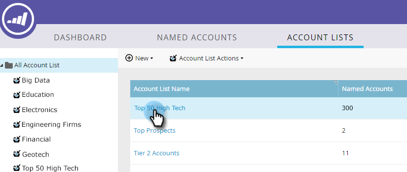

# 顧客リストインサイト {#account-list-insights}

顧客リストダッシュボードには、リスト内のすべての重点顧客から集計したインサイトのビューが表示されます。

>[!NOTE]
>
>Marketo TAM は、生成されたパイプラインまたは顧客エンゲージメントスコアに基づいて、顧客リスト内の上位の重点顧客を自動的に決定します。

## 顧客リストダッシュボード {#account-list-dashboard}

顧客リストダッシュボードを表示するには、その名前をクリックします。

...ダッシュボードが表示されます。

<table> 
 <tbody> 
  <tr> 
   <td colspan="1"><strong>パイプライン</strong></td> 
   <td colspan="1">経時的なパイプラインを表示します。週ごとの経時的なパイプラインを判断するため、最終日にパイプラインを取得します。</td> 
  </tr> 
  <tr> 
   <td><strong>売上高</strong></td> 
   <td>
経時的な売上高を表示します。週ごとの経時的な売上高を判断するため、その週の全売上高の合計を取り込みます。
</td> 
  </tr> 
 </tbody> 
</table>

## 重点顧客タブ {#named-accounts-tab}

「**重点顧客**」タブをクリックして、該当する顧客リストに属する重点顧客を確認します。

>[!NOTE]
>
>このタブで重点顧客を選択して「**重点顧客を削除**」をクリックして、重点顧客を削除することができます。

## 使用者タブ {#used-by-tab}

「**使用者**」タブをクリックして、どのアセットがその顧客リストを参照しているかを確認します。

